# Hadoop 指导文档

[TOC]

> - By 信息科学技术学院 郑力 冯存光
> - 文档如有错误或建议，烦请联系助教

## 安装配置虚拟机

安装好虚拟机和 ubuntu 18.04 LTS 并启动。

## 安装 jdk hadoop 等软件

将软件源替换为 TUNA 的软件源镜像 ，加快软件下载速度

Ubuntu 的软件源配置文件是 /etc/apt/sources.list

```shell
sudo gedit /etc/apt/sources.list
```

然后将该文件内容替换为下面内容，ctrl s 保存。

```sh
# 默认注释了源码镜像以提高 apt update 速度，如有需要可自行取消注释
deb https://mirrors.tuna.tsinghua.edu.cn/ubuntu/ bionic main restricted universe multiverse
# deb-src https://mirrors.tuna.tsinghua.edu.cn/ubuntu/ bionic main restricted universe multiverse
deb https://mirrors.tuna.tsinghua.edu.cn/ubuntu/ bionic-updates main restricted universe multiverse
# deb-src https://mirrors.tuna.tsinghua.edu.cn/ubuntu/ bionic-updates main restricted universe multiverse
deb https://mirrors.tuna.tsinghua.edu.cn/ubuntu/ bionic-backports main restricted universe multiverse
# deb-src https://mirrors.tuna.tsinghua.edu.cn/ubuntu/ bionic-backports main restricted universe multiverse
deb https://mirrors.tuna.tsinghua.edu.cn/ubuntu/ bionic-security main restricted universe multiverse
# deb-src https://mirrors.tuna.tsinghua.edu.cn/ubuntu/ bionic-security main restricted universe multiverse

# 预发布软件源，不建议启用
# deb https://mirrors.tuna.tsinghua.edu.cn/ubuntu/ bionic-proposed main restricted universe multiverse
# deb-src https://mirrors.tuna.tsinghua.edu.cn/ubuntu/ bionic-proposed main restricted universe multiverse
```

安装 jdk8

```shell
sudo apt update #更新软件源的metadata
sudo apt install openjdk-8-jdk-headless
sudo apt install net-tools openssh-server
```

配置环境变量

```sh
gedit ~/.bashrc
```

在文件末另起一行添加如下内容，并保存

```shell
export JAVA_HOME=/usr/lib/jvm/java-8-openjdk-amd64/
```

运行命令 source ~/.bashrc 使之生效。

然后我们下载 hadoop，并解压到 /usr/local/hadoop/ ，最后修改权限：

```sh
cd ~/Downloads
wget "https://mirrors.tuna.tsinghua.edu.cn/apache/hadoop/common/hadoop-2.7.7/hadoop-2.7.7.tar.gz"

sudo mkdir /usr/local/hadoop
sudo tar xzf hadoop-2.7.7.tar.gz -C /usr/local/hadoop

sudo chmod -R 755 /usr/local/hadoop/hadoop-2.7.7
sudo chown -R alice:alice /usr/local/hadoop/hadoop-2.7.7
```

运行一下 hadoop 看版本信息

```sh
/usr/local/hadoop/hadoop-2.7.7/bin/hadoop version
```

为了方便以后每次运行 hadoop 都不用写这么长的路径，配置一下环境变量，在~/.bashrc 文件末加上如下内容并保存。

```sh
export HADOOP_HOME=/usr/local/hadoop/hadoop-2.7.7
export PATH=$PATH:$HADOOP_HOME/sbin
export PATH=$PATH:$HADOOP_HOME/bin
```

然后运行命令 source ~/.bashrc 使之生效。当我们再次运行 /usr/local/hadoop/hadoop-2.7.7/sbin 和 /usr/local/hadoop/hadoop-2.7.7/sbin 目录下的程序的时候，不用再长长的输入绝对路径： 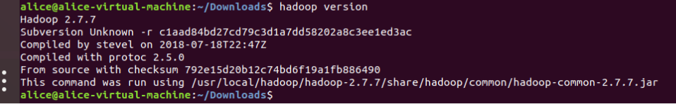

## Hadoop 单机版/伪分布式版

### 单机版运行

Hadoop 默认即为单机版。

```sh
cd /tmp/
mkdir /tmp/input
cp /usr/local/hadoop/hadoop-2.7.7/etc/hadoop/*.xml /tmp/input   # 将配置文件作为输入文件
hadoop jar /usr/local/hadoop/hadoop-2.7.7/share/hadoop/mapreduce/hadoop-mapreduce-examples-2.7.7.jar grep /tmp/input /tmp/output 'dfs[a-z.]+'
cat /tmp/output/*          # 查看运行结果
```

结果表明符合正则表达式'dfs[a-z.]+'的单词只出现了一次： 

Hadoop 不会自动覆盖结果文件，如想再运行上述例子需先删除结果

```sh
rm -r /tmp/output
```

### 伪分布式版配置和启动

1. ssh 无密登陆设置

尝试使用 ssh 登陆本机

```sh
ssh localhost
```

第一次登陆会有 SSH 登陆提示，输入 yes，并输入用户密码，即可 SSH 登陆至本机。然后配置 SSH 无密码登陆：

```sh
exit                   # 退出刚才的 ssh localhost
cd ~/.ssh/             # 若没有该目录，请先执行一次ssh localhost
ssh-keygen -t rsa      # 生成密钥对，会有提示，都按回车就可以
cat ./id_rsa.pub >> ./authorized_keys  # 加入授权
```

此时再 ssh localhost 即可无密登陆，注意记得 exit 回原终端。

1. 修改 hadoop 的配置文档

   修改 /usr/local/hadoop/hadoop-2.7.7/etc/hadoop/core-site.xml 配置文件 未修改之前是： 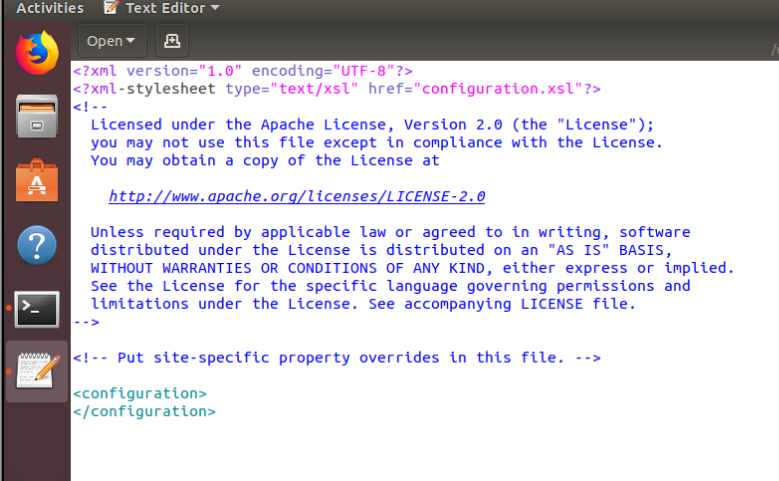

   配置改成

   ```xml
   <configuration>
       <property>
                <name>hadoop.tmp.dir</name>
                <value>file:/usr/local/hadoop/hadoop-2.7.7/tmp</value>
                <description>Abase for other temporary directories.</description>
           </property>
           <property>
                <name>fs.defaultFS</name>
                <value>hdfs://localhost:9000</value>
           </property>
   </configuration>
   ```

2. 然后修改 /usr/local/hadoop/hadoop-2.7.7/etc/hadoop/hdfs-site.xml

   ```xml
   <configuration>
           <property>
                <name>dfs.replication</name>
                <value>1</value>
           </property>
           <property>
                <name>dfs.namenode.name.dir</name>
                <value>file:/usr/local/hadoop/hadoop-2.7.7/tmp/dfs/name</value>
           </property>
           <property>
                <name>dfs.datanode.data.dir</name>
                <value>file:/usr/local/hadoop/hadoop-2.7.7/tmp/dfs/data</value>
           </property>
   </configuration>
   ```

   先别急，修改 `/usr/local/hadoop/hadoop-2.7.7/etc/hadoop/hadoop-env.sh` ，将 `export JAVA_HOME=${JAVA_HOME}` 改成 `export JAVA_HOME=/usr/lib/jvm/java-8-openjdk-amd64`

3. 执行 NameNode 的格式化：

   ```sh
   hdfs namenode -format
   ```

   出现“Exitting with status 0” 的提示说明成功。

4. 接着开启 NameNode 和 DataNode 守护进程：

   ```sh
   start-dfs.sh
   ```

5. 启动完成后，可以通过命令 jps 来判断是否成功启动，若成功启动则会列出如下进程: 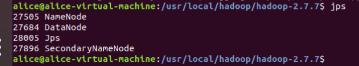

   此时打开 firefox 访问 <http://localhost:50070> 可以查看 NameNode 和 Datanode 信息，还可以在线查看 HDFS 中的文件。

### 伪分布式版实例运行

1. 创建目录，并将本地配置文件作为输入复制到分布式系统。

   ```sh
   hdfs dfs -mkdir -p /user/alice
   hdfs dfs -mkdir input
   cd /usr/local/hadoop/hadoop-2.7.7
   hdfs dfs -put ./etc/hadoop/*.xml input
   ```

   上面最后一条命令执行后，可能会报一个 WARN，但是无妨，通过如下命令查看文件是否被传到 input 文件夹下了

   ```sh
   hdfs dfs -ls input
   ```

   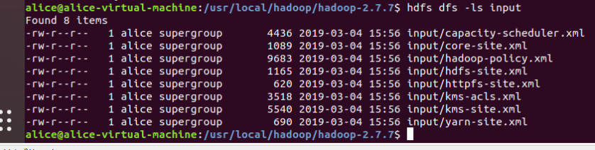

2. 执行实例,并查看结果

   ```sh
   hadoop jar ./share/hadoop/mapreduce/hadoop-mapreduce-examples-*.jar grep input output 'dfs[a-z.]+'
   hdfs dfs -cat output/*
   ```

   结果： 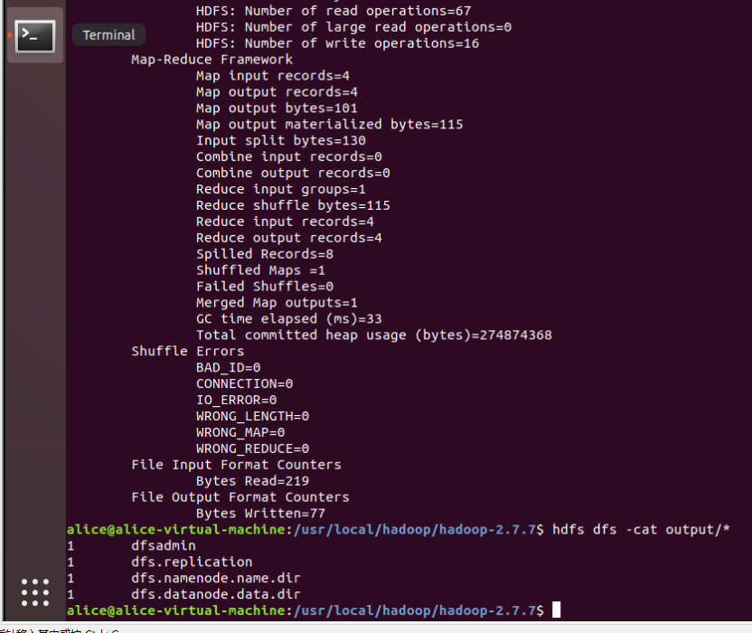

3. 将结果取回本地

   ```sh
   rm -r ./output    # 先删除本地的 output 文件夹（如果存在）
   hdfs dfs -get output ./output     # 将结果拷贝到本机
   cat ./output/*
   ```

4. 为不影响下次运行，及时删除输出文件

   ```sh
   hdfs dfs -rm -r output
   ```

5. 关闭 hadoop

   ```sh
   stop-dfs.sh
   ```

   下次开启时无需格式化，仅需命令 `start-dfs.sh` 即可

## Hadoop 全分布式版

请先完成上述单机版/伪分布式版后再进行本版本操作

### 基础网络配置

1. 虚拟机复制
   将之前配置好的带有伪分布式版 Hadoop 的 Ubuntu 系统链接克隆三份，分别为 Master、Slave1、Slave2(至少需要一个 Master 和一个 Slave，原虚拟机也需保留，之后其他软件安装时会有用到)

   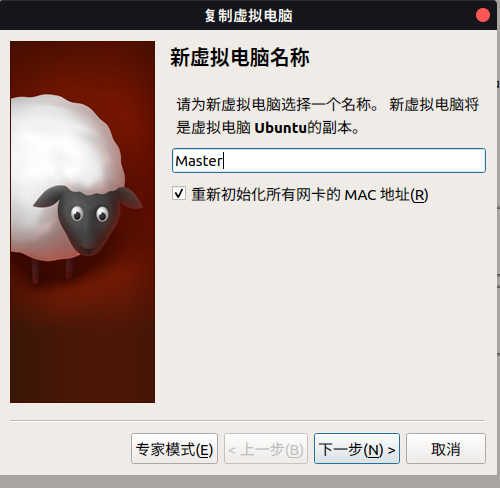

2. 管理-->全局设定-->网络-->NatNetwork(若没有请添加新的 NAT 网络)-->编辑 NAT 网络。
   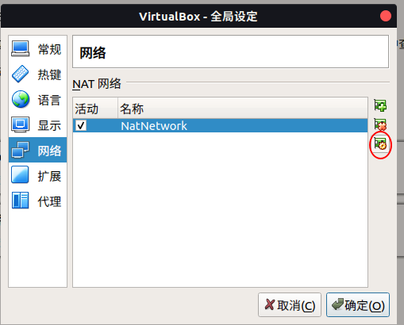

   取消勾选"支持 DHCP"，填写网络 CIDR 为 `192.168.8.0/24` ，确定。

   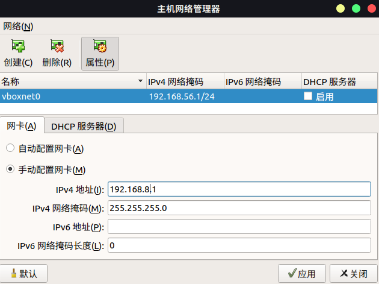

3. 确保每个虚拟机都是 NAT 模式以及 mac 地址互不相同。

   选中虚拟机，设置-->网络-->网卡 1-->连接方式设为 NAT 网络，界面名称设为刚才创建的 NAT 网络名称。MAC 地址可以随机生成防止冲突(克隆时已经随机生成了)。

   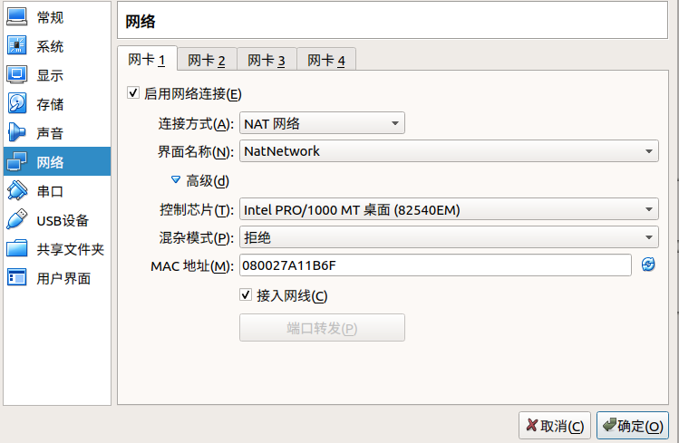

4. Ubuntu 网络配置。

    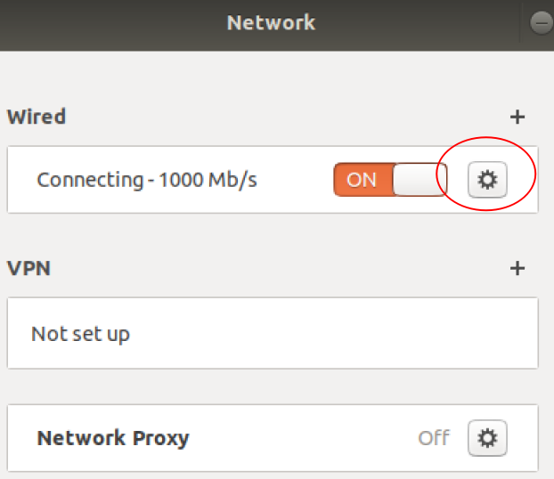 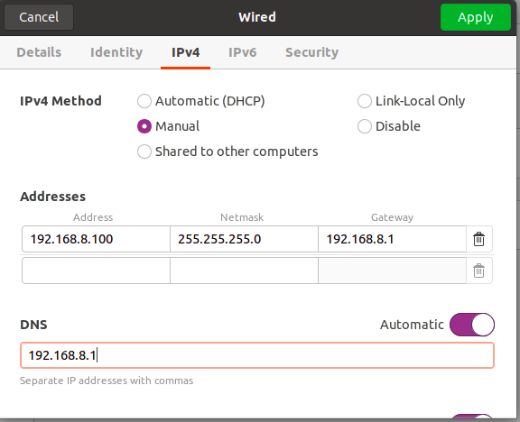

   本教程中，三节点的 Address 分别设置为 192.168.8.100/101/102

5. hosts 配置 在 Master 机中，修改主机名,将原名直接替换为“Master”即可。

   ```sh
   sudo gedit /etc/hostname
   ```

   之后修改/etc/hosts 的前几行，如下配置。注意 127.0.0.1 仅可对应 localhost，不可保留有其他对应行。

   ```sh
   127.0.0.1   localhost
   192.168.8.100   Master
   192.168.8.101   Slave1
   192.168.8.102   Slave2
   ```

   在 Slave1、Slave2 机上作类似操作，操作后均需重启生效。 在 3 个虚拟机上分别尝试互相 Ping，如果都能 ping 通则没问题。

   ```sh
   ping -c 3 Master
   ping -c 3 Slave1
   ping -c 3 Slave2
   ```

### 无密码登录节点

由于 Master 和 Slave 都是从伪分布式配置后的虚拟机克隆的，含有一样的密钥对，所以正常情况下能够登陆：

```sh
ssh Master
ssh Slave1
ssh Slave2
```

输入 yes 回车即可登陆成功，exit 退回原来终端后再次 ssh 即可直接无密登陆。
如果不能成功，请按照文末 [无密码登录](#无密码登录配置) 配置进行配置。

### 分布式环境配置

0. 配置/usr/local/hadoop/hadoop-2.7.7/etc/hadoop 下的五个配置文件

   ```sh
   cd /usr/local/hadoop/hadoop-2.7.7/etc/hadoop
   ```

1. slaves 文件,将内容替换为如下内容

   ```text
   Slave1
   Slave2
   ```

2. core-site.xml 文件。将内容修改为如下内容(上面步骤已经改过此文件，此处实际只需将 localhost 改为 Master)

   ```xml
   <configuration>
       <property>
                <name>hadoop.tmp.dir</name>
                <value>file:/usr/local/hadoop/hadoop-2.7.7/tmp</value>
                <description>Abase for other temporary directories.</description>
           </property>
           <property>
                <name>fs.defaultFS</name>
                <value>hdfs://Master:9000</value>
           </property>
   </configuration>
   ```

3. hdfs-site.xml 文件

   ```xml
   <configuration>
           <property>
                   <name>dfs.namenode.secondary.http-address</name>
                   <value>Master:50090</value>
           </property>
           <property>
                <name>dfs.replication</name>
                <value>2</value>
           </property>
           <property>
                <name>dfs.namenode.name.dir</name>
                <value>file:/usr/local/hadoop/hadoop-2.7.7/tmp/dfs/name</value>
           </property>
           <property>
                <name>dfs.datanode.data.dir</name>
                <value>file:/usr/local/hadoop/hadoop-2.7.7/tmp/dfs/data</value>
           </property>
   </configuration>
   ```

4. mapred-site.xml 文件。
   首先执行 `cp mapred-site.xml.template mapred-site.xml` 之后修改内容

   ```xml
   <configuration>
           <property>
                   <name>mapreduce.framework.name</name>
                   <value>yarn</value>
           </property>
           <property>
                   <name>mapreduce.jobhistory.address</name>
                   <value>Master:10020</value>
           </property>
           <property>
                   <name>mapreduce.jobhistory.webapp.address</name>
                   <value>Master:19888</value>
           </property>
   </configuration>
   ```

5. yarn-site.xml 文件

   ```xml
   <configuration>
           <property>
                   <name>yarn.resourcemanager.hostname</name>
                   <value>Master</value>
           </property>
           <property>
                   <name>yarn.nodemanager.aux-services</name>
                   <value>mapreduce_shuffle</value>
           </property>
   </configuration>
   ```

   最后我们需要把 Hadoop 从 Master 复制到 Slave 节点， 但是由于我们之更改了一些配置文件，所以只需要复制 Master 的配置文件到 Slave 节点覆盖就好了。

   ```sh
   #先清理一些临时文件
   cd /usr/local/hadoop/hadoop-2.7.7;rm -r ./tmp ./logs/*
   ssh Slave1 "cd /usr/local/hadoop/hadoop-2.7.7;rm -r ./tmp ./logs/*"
   ssh Slave1 "cd /usr/local/hadoop/hadoop-2.7.7;rm -r ./tmp ./logs/*"
   #复制Master的配置文件到Slave节点
   scp /usr/local/hadoop/hadoop-2.7.7/etc/hadoop/* Slave1:/usr/local/hadoop/hadoop-2.7.7/etc/hadoop/
   scp /usr/local/hadoop/hadoop-2.7.7/etc/hadoop/* Slave2:/usr/local/hadoop/hadoop-2.7.7/etc/hadoop/
   ```

   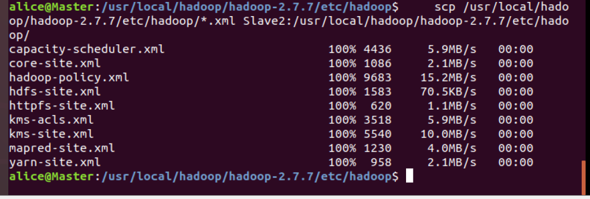

### 分布式版 Hadoop 启动

1. 格式化，仅第一次启动前需要执行(Master 上执行)

   ```sh
   hdfs namenode -format
   ```

2. 启动(Master 上执行)

   ```sh
   start-dfs.sh
   start-yarn.sh
   mr-jobhistory-daemon.sh start historyserver
   ```

   通过 jps 命令可查看进程，在 Master 上进程如下(五个进程必须全部启动，如有缺失即为启动有错。端口号不一样为正常现象)

   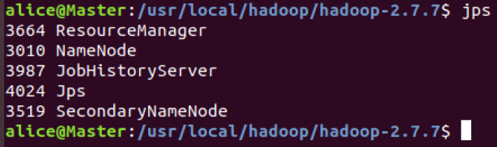

   在 Slave 节点上进程如下 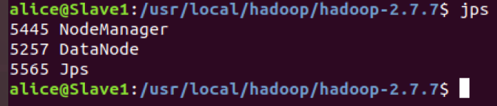

   另外，在 Master 上通过命令 `hdfs dfsadmin -report` 查看节点是否正常启动，若启动成功可在返回的报告中看到：Live datanodes (2) 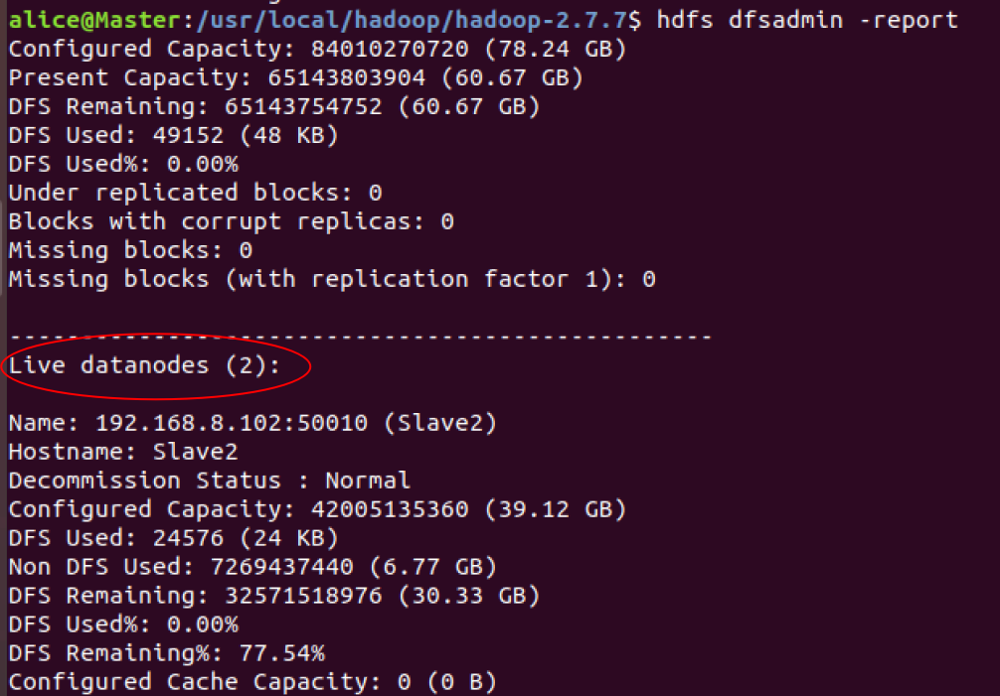

   在 firefox 中查看网页 <http://localhost:50070/dfshealth.html#tab-datanode> 也可确定 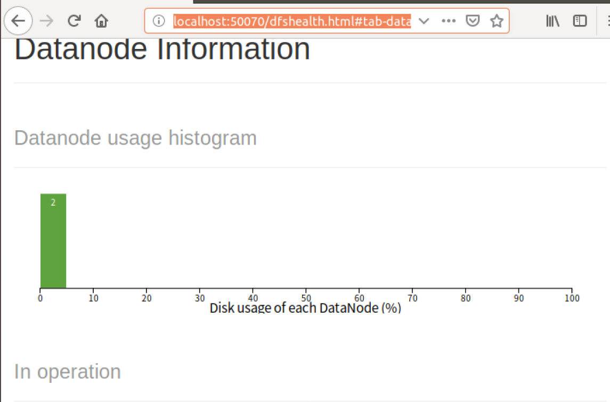

### 分布式版实例运行

0. 均在 Master 上执行操作

1. 创建 hdfs 上的用户目录

   ```sh
   hdfs dfs -mkdir -p /user/alice
   ```

2. 将本地文件复制入 input

   ```sh
   hdfs dfs -mkdir input
   hdfs dfs -put /usr/local/hadoop/hadoop-2.7.7/etc/hadoop/*.xml input
   hdfs dfs -ls input
   ```

   在网页端可查看节点上的占用情况发生了变化，说明上传成功 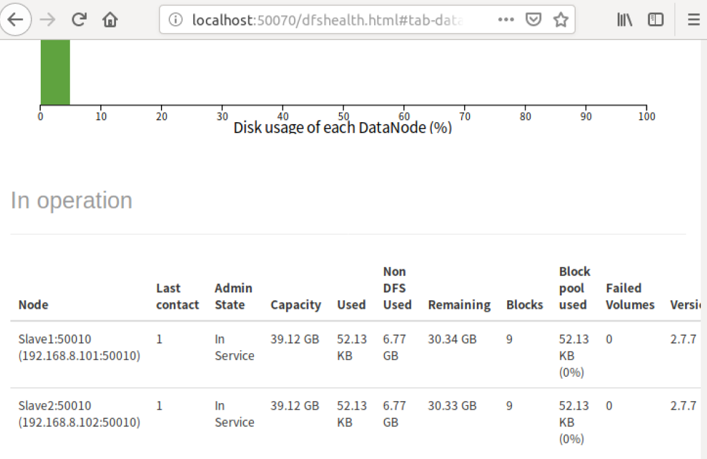

3. 执行实例

   ```sh
   hadoop jar /usr/local/hadoop/hadoop-2.7.7/share/hadoop/mapreduce/hadoop-mapreduce-examples-*.jar grep input output 'dfs[a-z.]+'
   ```

   运行时的输出信息与伪分布式类似，会显示 Job 的进度。 可能会有点慢，若迟迟没有进度(如 5 分钟)，不妨重启 Hadoop 再试试。若仍不行，则很有可能是内存不足引起，建议增大虚拟机的内存

4. 获取结果

   ```sh
   hdfs dfs -cat output/*
   ```

   结果如下 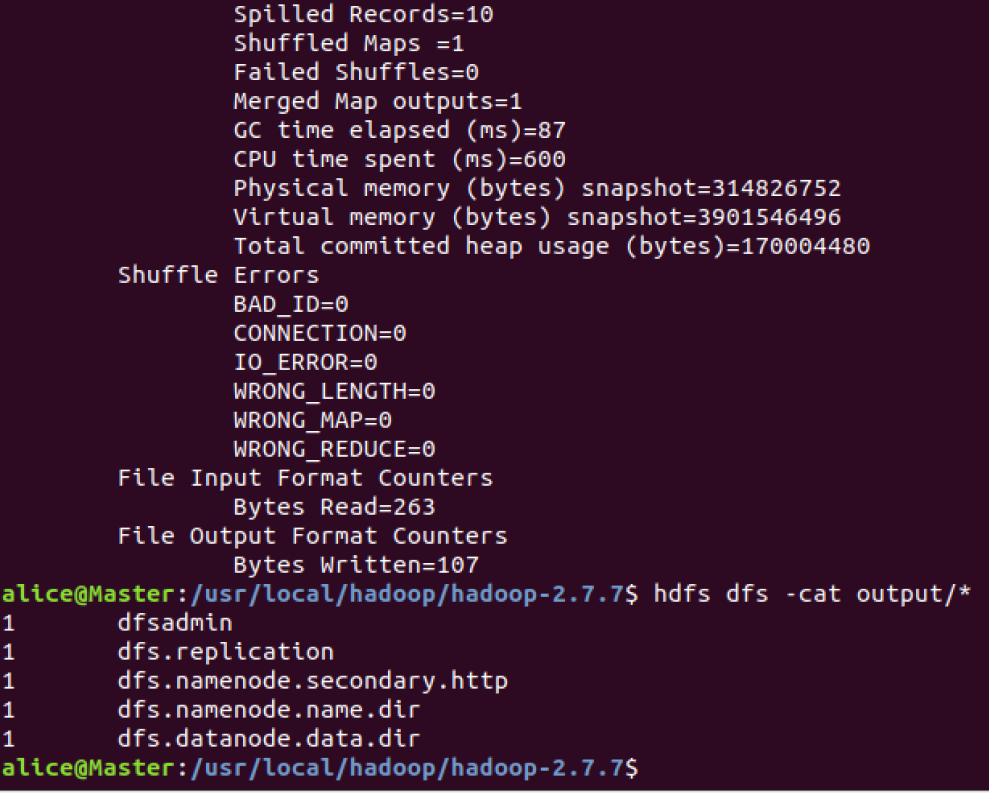

5. 关闭 Hadoop

   ```sh
   stop-yarn.sh
   stop-dfs.sh
   mr-jobhistory-daemon.sh stop historyserver
   ```

## 编写 Hadoop 应用

### Eclipse 中编写 Hadoop 应用

使用 eclipse 编写 Java 可以方便代码补全和提示。安装 eclipse (在 Master 节点)

```sh
cd Downloads
wget "https://mirrors.tuna.tsinghua.edu.cn/eclipse/technology/epp/downloads/release/luna/SR2/eclipse-java-luna-SR2-linux-gtk-x86_64.tar.gz"
```

解压后，双击 eclipse 文件夹下的 eclipse 运行

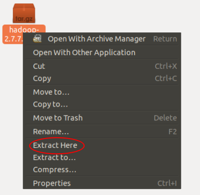 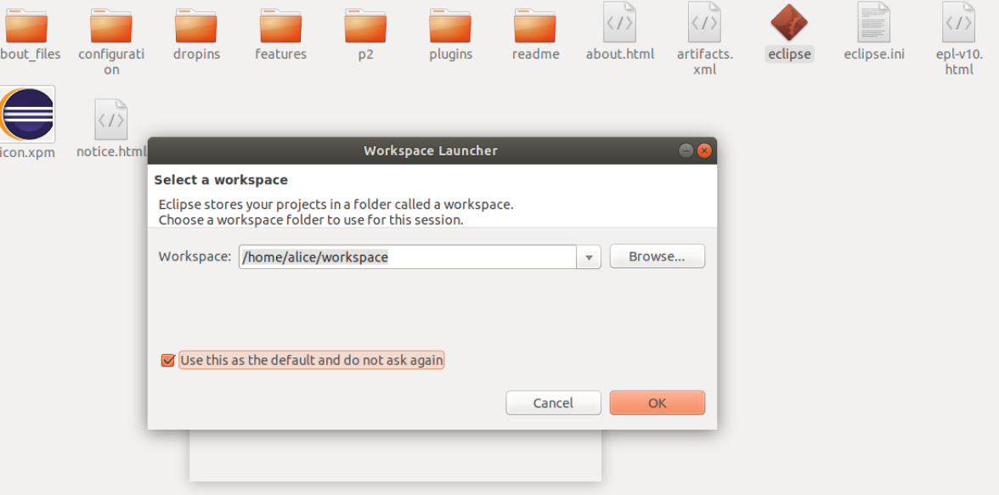

我们来导入 hadoop 的 jar 包，菜单栏 Window --> Preferences --> Java --> Build Path --> User Libraries --> New 输入 hadoop_common 。

然后选中 hadoop_common 添加外部 jar，浏览到/usr/local/hadoop/hadoop2.7.7/share/hadoop/common，添加这个目录下的所有.jar 文件(按住 ctrl 多选)，然后添加/usr/local/hadoop/hadoop2.7.7/share/hadoop/common/lib 下的所有 jar 包。

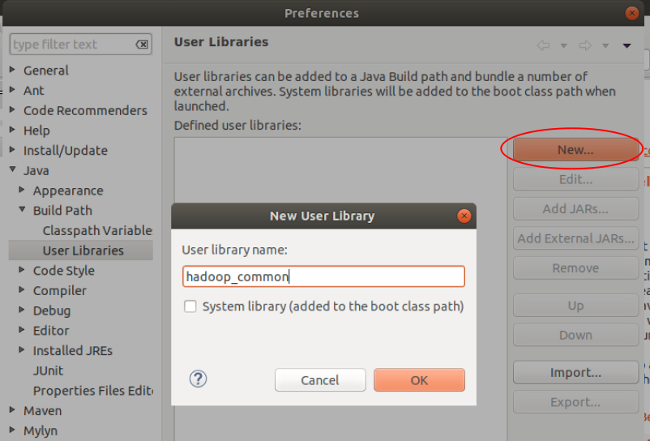 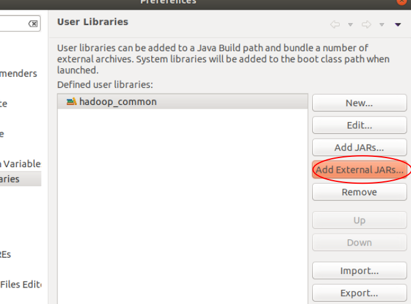 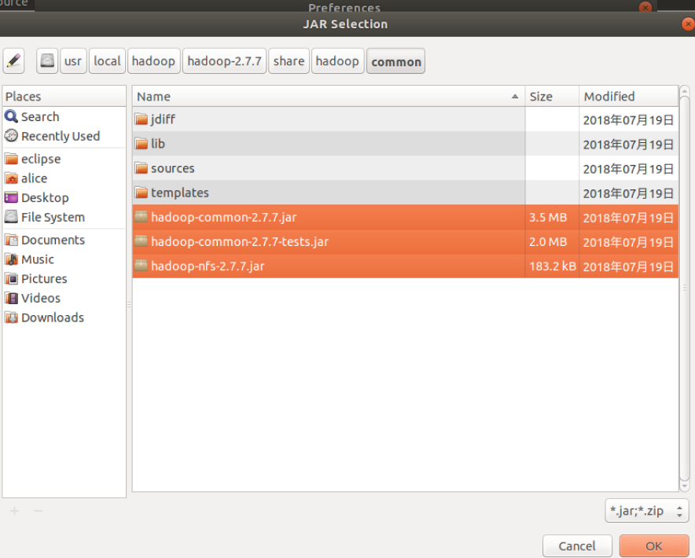 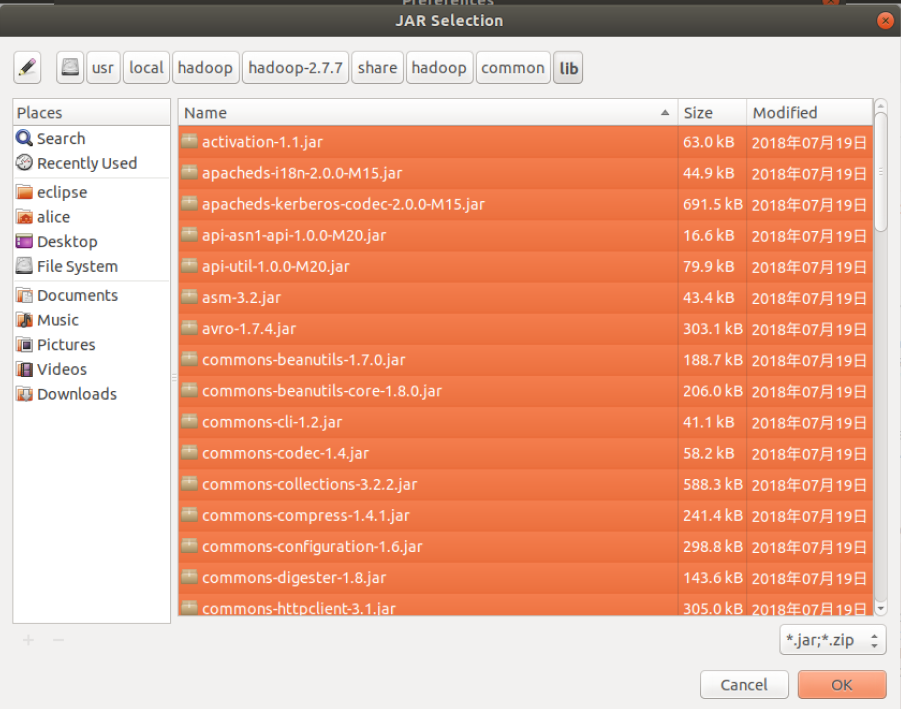

按此过程依次添加/usr/local/hadoop/hadoop2.7.7/share/hadoop 下的如下 jar 包：

```sh
新建 hadoop_hdfs 的用户库，然后添加 share\hadoop\hdfs 和 share\hadoop\hdfs\lib 下的jar包
新建 hadoop_mapreduce 的用户库，然后添加 share\hadoop\mapreduce 和 share\hadoop\mapreduce\lib 下的jar包
```

添加完成后：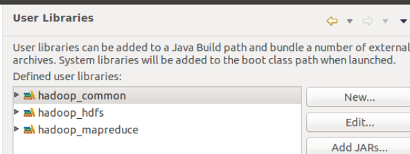

然后我们新建 java 工程，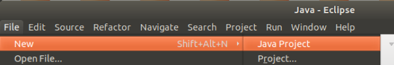 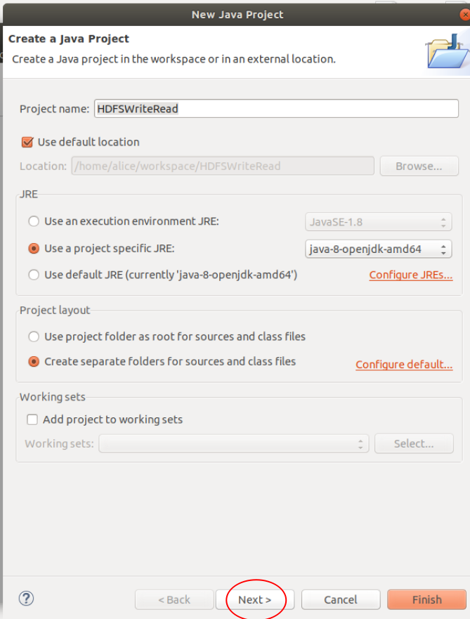

新建过程中加入用户库，不过对于这个简单的例子包含 hadoop_common 和 hadoop_hdfs 就可以了：

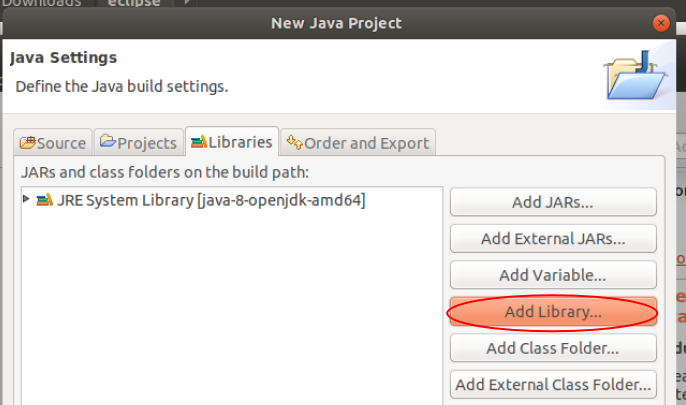 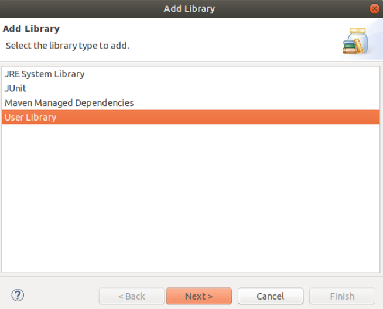 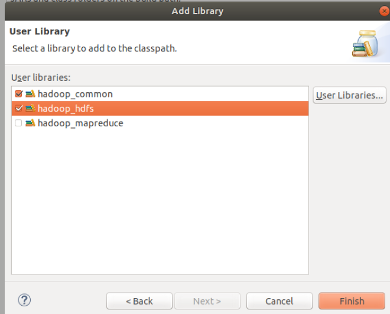

建好工程后在 src 上右键新建类：

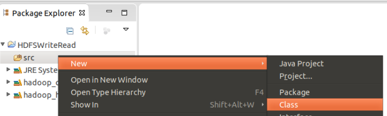 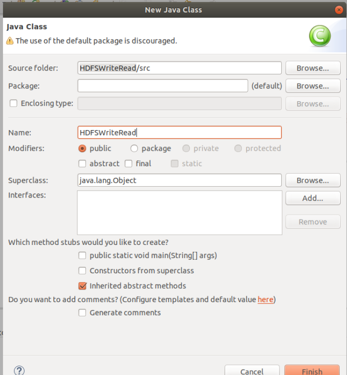

确保你的三个虚拟机以及 hdfs 都处在开启状态。

编写 hdfs 读写程序样例

```java
import org.apache.hadoop.conf.Configuration;
import org.apache.hadoop.fs.FileSystem;
import org.apache.hadoop.fs.Path;
import org.apache.hadoop.fs.FSDataOutputStream;
import org.apache.hadoop.fs.FSDataInputStream;
import java.io.BufferedReader;
import java.io.IOException;
import java.io.InputStreamReader;

public class HDFSWriteRead {
  public static void main(String[] args){
    try{
     String fileName = "test";
     Configuration conf = new Configuration();
     conf.set("fs.defaultFS", "hdfs://Master:9000");
     conf.set("fs.hdfs.impl", "org.apache.hadoop.hdfs.DistributedFileSystem");
     FileSystem fs = FileSystem.get(conf);
     Path file = new Path(fileName);
     if(fs.exists(file)){
       System.out.println("File exists");
     }else{
       System.out.println("File does not exist");
       createFile(fs,file);
     }
     readFile(fs,file);
     fs.close();
   }catch (Exception e){
     e.printStackTrace();
   }
 }
  public static void createFile(FileSystem fs, Path file) throws IOException{
    byte[] buff = "Hello World".getBytes();
    FSDataOutputStream os =fs.create(file);
    os.write(buff,0,buff.length);
    System.out.println("Create:"+file.getName());
    os.close();
  }
  public static void readFile(FileSystem fs, Path file) throws IOException{
    FSDataInputStream in = fs.open(file);
    BufferedReader d = new BufferedReader(new InputStreamReader(in));
    String content = d.readLine();
    System.out.println(content);
    d.close();
    in.close();
  }
}
```

该程序的功能是判断名字为 test 的文件是否存在于 hdfs 中，如果存在则读取内容，否则先创建再读取。

运行结果如下

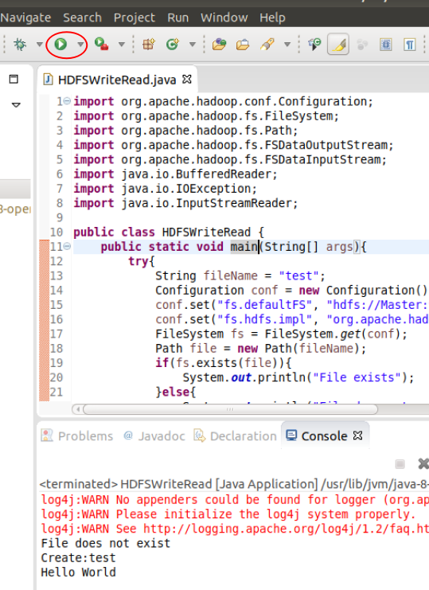

现在我们尝试将程序打包运行

```sh
mkdir /usr/local/hadoop-2.7.7/myapp
```

File --> Export --> Runnable JAR File --> Next

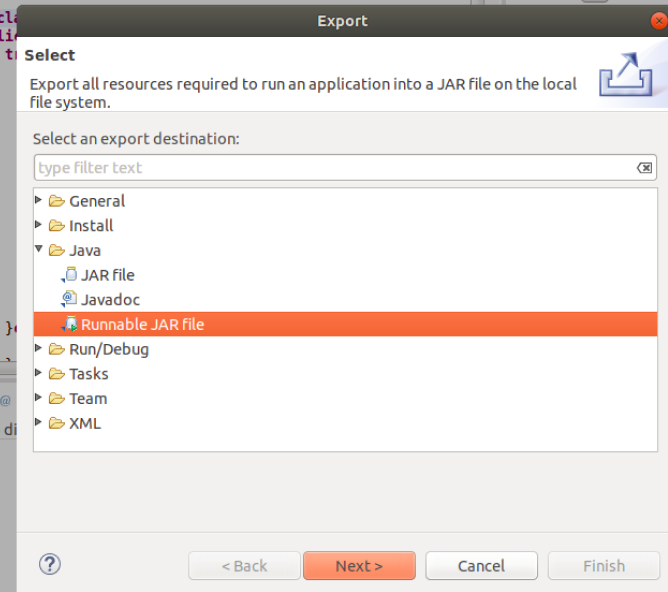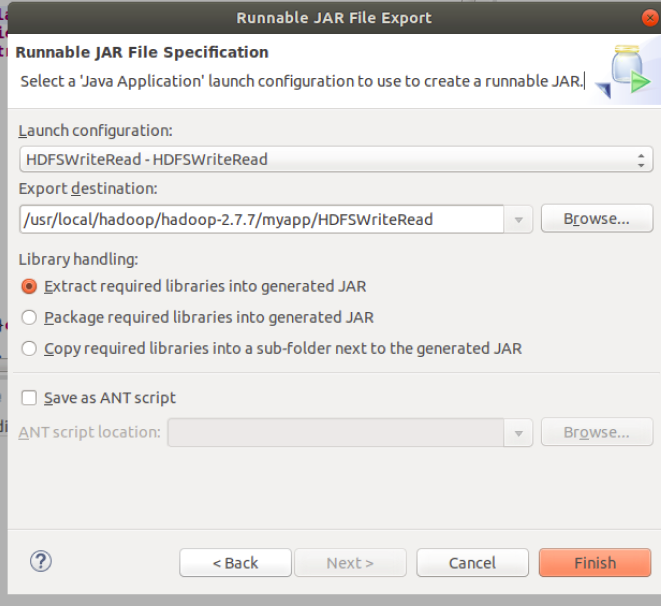 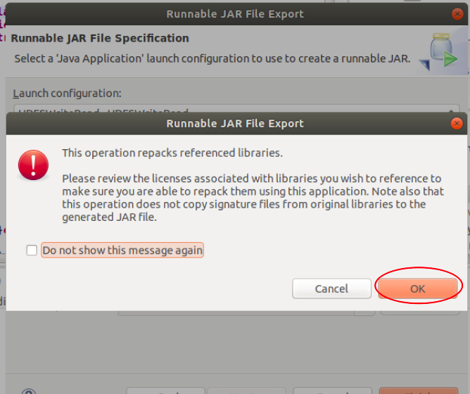

进入目录运行 hadoop 执行该 jar 包：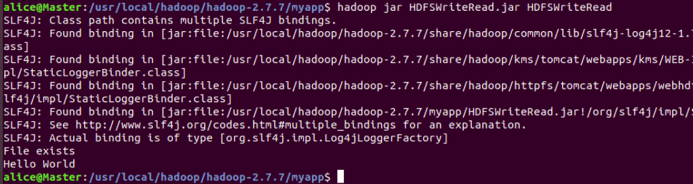

### 命令行下编译运行 hadoop 应用

如果你使用的是 Server 版本的 Ubuntu，需要在命令行下进行代码编辑和编译。否则不需要。

在~/.bashrc 末尾添加

```sh
export HADOOP_CLASSPATH=$(find $HADOOP_HOME -name '*.jar' | xargs echo | tr ' ' ':')
```

执行`source ~/.bashrc`

然后编译打包运行：

```sh
mkdir build
javac -classpath ${HADOOP_CLASSPATH} -d build/ HDFSWriteRead.java
jar -cvf HDFSWriteRead.jar -C build ./
hadoop jar HDFSWriteRead.jar HDFSWriteRead
```

<u>[**恭喜，完成了！**](#Hadoop指导文档)</u>

## 附录

### 无密码登录配置

原理：首先由用户生成一对密钥，然后将公钥保存在 SSH 服务器用户的目录下.ssh 子目录中的 authorized_key 文件里(/root/.ssh/authorized_key).私钥保存在本地计算机.当用户登陆时,服务器检查 authorized_key 文件的公钥是否与用户的私钥对应,如果相符则允许登入,否则拒绝.由于私钥只有保存在用户的本地计算机中,因此入侵者就算得到用户口令,也不能登陆到服务器.

在 Master 机上操作：

```sh
cd ~/.ssh           # 如果没有该目录，先执行一次ssh localhost
rm ./id_rsa*        # 删除之前生成的公匙（如果有）
ssh-keygen -t rsa   # 生成一对rsa密钥
```

使本机无密 SSH 本机，键入如下命令

```shell
cat ./id_rsa.pub >> ./authorized_keys
```

完成后尝试 ssh Master 验证(可能需要输入 yes，之后 exit 退回原终端) 之后将公钥传输至 Slave(需要输入节点密码)

```sh
scp ~/.ssh/id_rsa.pub Slave1:~/
scp ~/.ssh/id_rsa.pub Slave2:~/
```

在 Slave1、Slave2 上操作：

```sh
cat ~/id_rsa.pub >> ~/.ssh/authorized_keys
rm ~/id_rsa.pub    # 用完就可以删掉了
```

在 Master 上操作： 尝试是否能够无密登陆子节点

```sh
ssh Slave1 #注意exit回原终端
ssh Slave2 #注意exit回原终端
```

成功后就可以继续[配置分布式环境](#分布式环境配置)了
