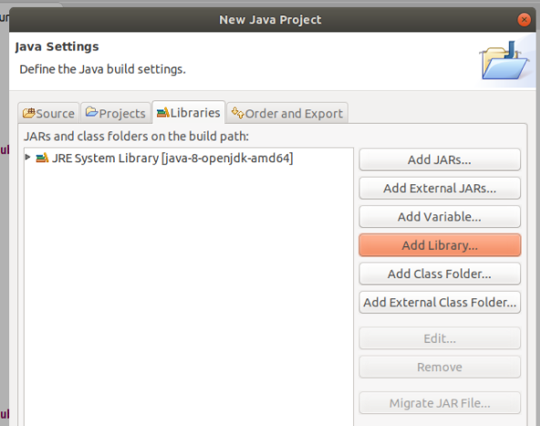
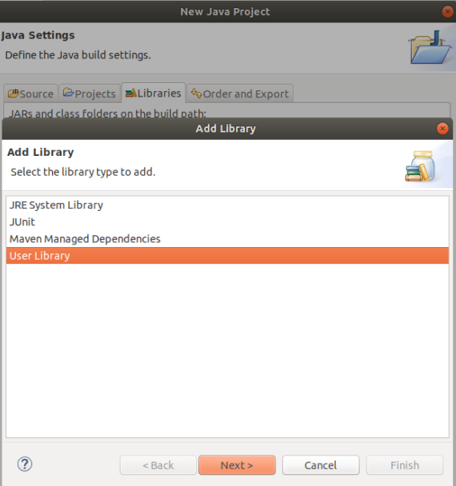
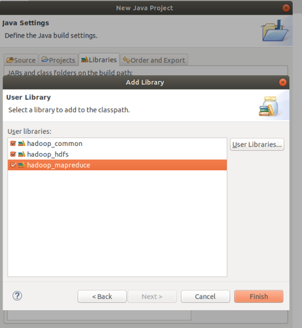
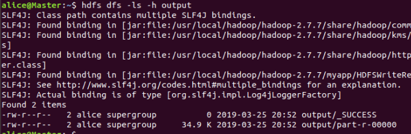
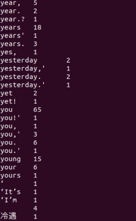
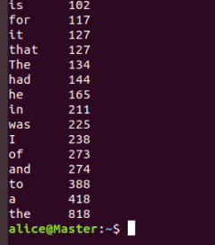

# word count 示例

新建 Java 工程，记得添加用户库。



新建 java 类 WordCount，粘贴以下代码保存。

```java
import java.io.IOException;
import java.util.StringTokenizer;
import org.apache.hadoop.conf.Configuration;
import org.apache.hadoop.fs.Path;
import org.apache.hadoop.io.IntWritable;
import org.apache.hadoop.io.Text;
import org.apache.hadoop.mapreduce.Job;
import org.apache.hadoop.mapreduce.Mapper;
import org.apache.hadoop.mapreduce.Reducer;
import org.apache.hadoop.mapreduce.lib.input.FileInputFormat;
import org.apache.hadoop.mapreduce.lib.output.FileOutputFormat;

public class WordCount {

  public static class TokenizerMapper extends Mapper<Object, Text, Text, IntWritable>{
    private final static IntWritable one = new IntWritable(1);
    private Text word = new Text();

    public void map(Object key, Text value, Context context) throws IOException, InterruptedException {
      StringTokenizer itr = new StringTokenizer(value.toString());
      while (itr.hasMoreTokens()) {
        word.set(itr.nextToken());
        context.write(word, one);
      }
    }

  }

  public static class IntSumReducer extends Reducer<Text,IntWritable,Text,IntWritable> {
    private IntWritable result = new IntWritable();

    public void reduce(Text key, Iterable<IntWritable> values, Context context) throws IOException, InterruptedException {
      int sum = 0;
      for (IntWritable val : values) {
        sum += val.get();
      }
      result.set(sum);
      context.write(key, result);
    }

  }

  public static void main(String[] args) throws Exception {

    if(args.length!=2){
        System.err.println("Uage: wordcount <in> <out>");
        System.exit(2);
    }

    Configuration conf = new Configuration();
    conf.set("fs.defaultFS", "hdfs://Master:9000");
    conf.set("fs.hdfs.impl", "org.apache.hadoop.hdfs.DistributedFileSystem");

    Job job = Job.getInstance(conf, "word count");
    job.setJarByClass(WordCount.class);
    job.setMapperClass(TokenizerMapper.class);
    job.setCombinerClass(IntSumReducer.class);
    job.setReducerClass(IntSumReducer.class);
    job.setOutputKeyClass(Text.class);
    job.setOutputValueClass(IntWritable.class);

    FileInputFormat.addInputPath(job, new Path(args[0]));
    FileOutputFormat.setOutputPath(job, new Path(args[1]));

    boolean ok = job.waitForCompletion(true);
    if(ok){
        System.out.println("Completed.");
    }else{
        System.err.println("Something wrong!");
    }
  }

}
```

然后导出为可运行 jar。

确保 hdfs 已经开启了。

```sh
hdfs dfs -rm input/*
hdfs dfs -rm -r output/
hdfs dfs -put 新概念英语第二册.txt input/
hadoop jar WordCount.jar input output
```

成功后 output 文件夹下会有\_SUCCESS 文件:



取回本地看一下

```sh
hdfs dfs -get output/part-r-00000 ./
less part-r-00000
```

按 q 退出



有很多标点符号也掺和进来了，这里你应该在 map 的过程中处理一下。

使用命令`sort part-r-00000 -n -k2` 按第二列的数字从小到大排序看一下：


