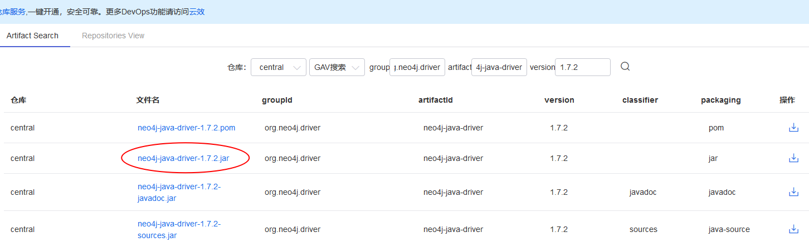

# 上机实习之 Neo4j 篇

大数据管理技术 NoSQL MongoDB

## **MongoDB 的安装**

### Linux 环境

1. https://neo4j.com/download-center/#releases ，选择 Community Server 标签，下载 tar 包，解压，移动到指定位置。

   ```sh
   tar -xf neo4j-community-3.5.4-unix.tar.gz
   sudo mv neo4j-community-3.5.4 /usr/local/neo4j-community
   sudo chmod -R 777 !$
   ```

2. 启动服务。

   ```sh
   cd /usr/local/neo4j-community/bin
   ./neo4j start
   ```

3. 执行`./cypher-shell`连接 neo4j, 默认用户名和密码都是为 neo4j，第一次进入 Cypher shell 环境，先修改密码 `CALL dbms.changePassword('new passwords');`

   退出：`:exit`

### Windows 环境

1. https://neo4j.com/download-center/#releases ，选择 Community Server 标签。下载 zip 包。

2. 解压到某个目录，比如 C 盘。

3. 启动服务

   ```sh
   cd "C:\neo4j-community\bin"
   .\neo4j.bat install-service
   .\neo4j.bat start
   ```

   显示`Neo4j service started`则表示启动成功。

4. 输入`.\cypher-shell.bat`，连接 neo4j，默认用户名和密码都是为 neo4j，成功后显示以下信息：
   `PS C:\neo4j-community\bin> .\cypher-shell.bat username: neo4j password: ***** Connected to Neo4j 3.5.4 at bolt://localhost:7687 as user neo4j. Type :help for a list of available commands or :exit to exit the shell. Note that Cypher queries must end with a semicolon. neo4j>`
   第一次进入 Cypher shell 环境，先修改密码 ` CALL dbms.changePassword('new passwords');`` 退出： `:exit`

## **Neo4j 的使用**

### 数据库操作

data/databases 目录下存放着数据库文件，但是 neo4j 默认只有一个数据库 graph.db 是可操作的，如果要创建或切换新的数据库，需要修改 conf/neo4j.conf 中的`dbms.active_database=graph.db`，并不会删除原有数据库。

### CQL 操作模型

Neo4j 中的图模型包括节点，关系，标签，属性

#### 创建节点

```neo4j
CREATE (
   <node-name>:<label-name>
   {
      <Property1-name>:<Property1-Value>
      ........
      <Propertyn-name>:<Propertyn-Value>
   }
)
```

创建学生张三节点：

```neo4j
create (n:student{name: "ZhangSan", major: "CS" , skill : [ "Redis", "MongoDB", "Cassandra" ] });
```

创建李四节点：

```neo4j
create (n:student{name:'LiSi',major:'AI', skill:['C++','Python','Java']});
```

创建课程节点：

```neo4j
create (n:course{name: "BigData", year: 2019});
```

#### 简单的查询

查询张三的信息：

```neo4j
match (s:student{name:"ZhangSan"}) return s;
```

结果如下：

```neo4j
+-------------------------------------------------------------------------------------------------+
| s                                                                                               |
+-------------------------------------------------------------------------------------------------+
| (:student {name: "ZhangSan", major: "CS", skill: ["Redis", "MongoDB", "Cassandra"]}) |
+-------------------------------------------------------------------------------------------------+

1 row available after 12 ms, consumed after another 1 ms
```

查询所有关系：

```neo4j
match (s)-[r]->(t)
return s.name, TYPE(r), t.name;
```

查询会 Redis 的同学的名字：

```neo4j
match (s:student) where "Redis" in s.skill return s.name;
```

注意括号里的 s 只是指代满足当前查询结果的节点(锚点)，相当于一个临时变量。

#### 创建关系

Cypher 用 pattern 来形象地表示满足一定条件的子图。
()表示节点，节点之间的关系用-->或-[]->表示，节点的标签和属性在()中指定，关系的标签和属性信息在[]中指定。
张三选修了 BigData，我们把选修关系和成绩加上。

```neo4j
match (s{name:"ZhangSan"}),(c:course{name:"BigData"})
create (s)-[r:elect{score:59}]->(c) ;
```

张三和李四是朋友：

```neo4j
match (s{name:"ZhangSan"}),(t{name:"LiSi"})
create (s)-[r:friend]->(t) ;
```

查询的时候可以忽略关系的方向，所以这里的 friend 是双向关系用一个单向关系表示也可以。
match (s:student)-[r:friend]-(t:student)

#### 修改/增加属性

我们把不及格的同学捞一下并做标记并返回姓名。

```neo4j
match (s:student)-[r:elect]->(c:course{name:"BigData"})
where r.score<60
set r.old_score=r.score, r.score=59
return s.name+" 下次注意点" as result;
```

#### 删除

张三同学打算退掉所有中期课程去休学。

```neo4j
match (s:student)-[r:elect]->(c:course)
delete r
create (s)-[t:drop]->(c) ;
```

使用 remove 删除标签和属性

#### merge

当模式存在时匹配该模式，不存在时创建该模式，在 merge 子句之后，可以显式指定 on creae 和 on match 子句，用于修改绑定的节点或关系的属性。这可以帮助我们避免重复，虽然也可以使用 CREATE UNIQUE 来创建唯一性约束。

```neo4j
MERGE (c:course { name: 'BigData' })
ON CREATE SET s.tasks = 0
ON MATCH SET s.tasks = s.tasks+1
RETURN c.name, c.tasks
```

#### 指定路径长度的查询

李四也选修了 BigData。

```neo4j
match (s{name:"LiSi"}),(c:course{name:"BigData"})
create (s)-[r:elect{score:88}]->(c) ;
```

找出两个人都选了 BigData 课程并且这两个人的朋友关系距离是 1~2（朋友或朋友的朋友）的姓名。

```
MATCH (me)-[:friend*1..2]-(remote_friend), (me)-[:elect]->(:course{name:"BigData"})<-[:elect]-(remote_friend)
return me.name, remote_friend.name;
```

### Java 中使用 Neo4j

[下载](https://central.maven.org/maven2/org/neo4j/driver/neo4j-java-driver/1.7.2/neo4j-java-driver-1.7.2.jar)neo4j 的 java driver，如果网络不畅，到[阿里云镜像](https://maven.aliyun.com/mvn/search)下载：



导入 eclipse 中，可以下载对应的 javadoc 并导入方便参考。

```java
import static org.neo4j.driver.v1.Values.parameters;

import java.util.Arrays;
import java.util.List;

import org.neo4j.driver.v1.AccessMode;
import org.neo4j.driver.v1.AuthTokens;
import org.neo4j.driver.v1.Driver;
import org.neo4j.driver.v1.GraphDatabase;
import org.neo4j.driver.v1.Record;
import org.neo4j.driver.v1.Session;
import org.neo4j.driver.v1.StatementResult;
import org.neo4j.driver.v1.Transaction;
import org.neo4j.driver.v1.Value;

public class SmallExample  implements AutoCloseable
{
    // Driver objects are thread-safe and are typically made available application-wide.
    Driver driver;

    public SmallExample(String uri, String user, String password)
    {
        driver = GraphDatabase.driver(uri, AuthTokens.basic(user, password));
    }

    private void addStudent(String name, String major, List<String> skills)
    {
        // Sessions are lightweight and disposable connection wrappers.
        try (Session session = driver.session())
        {
            // Wrapping Cypher in an explicit transaction provides atomicity
            // and makes handling errors much easier.
            try (Transaction tx = session.beginTransaction())
            {
                tx.run("merge (a:student {name: {x}, major:{y}, skills:{z}})", parameters("x",name,"y", major, "z",skills));
                tx.success();
            }
        }
    }
    private void addCourse(String name, int year)
    {
        // Sessions are lightweight and disposable connection wrappers.
        try (Session session = driver.session())
        {
          // autocommit transaction
        	session.run("create (a:course {name: {x}, year:{y}})", parameters("x", name, "y", year));
        }
    }
    private void addElect(String sname, String cname, int score)
    {
        try (Session session = driver.session())
        {
            session.run("match (s{name:{sname}}),(c:course{name:{cname}}) "+
                    "create (s)-[r:elect{score:{score}}]->(c);",
                    parameters("sname", sname, "cname",cname,"score",score));
        }
    }
    private StatementResult execute_read(String statement)
    {
    	try (Session session = driver.session(AccessMode.READ))
    	{
    		return session.run(statement);
    	}
    }

    public void close ()throws Exception
    {
        // Closing a driver immediately shuts down all open connections.
        driver.close();
    }

    public static void main(String... args) throws Exception
    {
       try( SmallExample example = new SmallExample("bolt://localhost:7687", "neo4j", "new passwords"))
       {//加入学生和课程节点
        example.addStudent("ZhangSan", "CS", Arrays.asList("Redis", "MongoDB", "Cassandra"));
        example.addStudent("LiSi", "AI", Arrays.asList("C++","Python","Java"));
        example.addCourse("BigData",2019);
        //加入选课关系
        example.addElect("ZhangSan", "BigData", 59);
        //修改并打印不及格学生的姓名
        StatementResult result = example.execute_read("match (s:student)-[r:elect]->(c:course{name:\"BigData\"}) "+
						"where r.score<60 "+
						"set r.old_score=r.score, r.score=59 "+
						"return s");
        while(result.hasNext()){
        	Record record = result.next();
        	Value node = record.get("s");
        	System.out.println(node.get("name"));
        }
       }
    }
}
```

详细参考 https://neo4j.com/docs/api/java-driver/current/

### Python 中使用 Neo4j

```sh
pip3 install -i https://pypi.tuna.tsinghua.edu.cn/simple neo4j
```

```python
from neo4j import GraphDatabase
from neo4j import Node

uri = 'bolt://localhost:7687'
driver = GraphDatabase.driver(uri, auth=('neo4j', 'new passwords'))

with driver.session() as session:
    #Auto-commit transactions
    session.run('merge (n:student{name: "ZhangSan", major: "CS" , skill : [ "Redis", "MongoDB", "Cassandra" ] });')

with driver.session() as session:
    tx = session.begin_transaction()
    statement='merge (n:student{name:$name,major:{major}, skill:{skill}});'
    tx.run(statement, name='LiSi',major='AI',skill=['C++','Python','Java'])
    tx.commit()


with driver.session() as session:
    session.run('create (n:course{name: $name, year: $year});', {'name':'BigData','year':2019})


def create_elect(tx,sname,cname,score):
    tx.run('match (s{name:$sname}),(c:course{name:$cname}) '
            'create (s)-[r:elect{score:$score}]->(c);',sname=sname,cname=cname,score=score);


with driver.session() as session:
    # use a transaction function
    session.write_transaction(create_elect,'ZhangSan', 'BigData', 59)

with driver.session(access_mode="read") as session:
    result = session.run('''match (s:student)-[r:elect]->(c:course{name:"BigData"})
where r.score<60
set r.old_score=r.score, r.score=59
return s;''');
    for record in result.records():
        node=record['s']
        print(node['name'])

```

详细参考https://neo4j.com/docs/api/python-driver/current/
