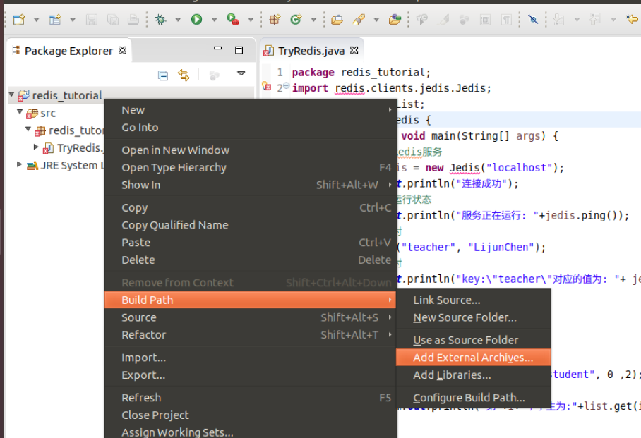

# 上机实习之 Redis 篇

大数据管理技术 NoSQL Redis

---

[TOC]

---

## Redis 的安装\*\*

### Linux 环境

1. 下载并安装稳定版本

   ```sh
   wget http://download.redis.io/releases/redis-stable.tar.gz
   tar xf redis-stable.tar.gz
   cd redis-stable
   make
   ```

2. 启动 Redis 服务端,保持该终端不关闭

   ```sh
   cd src
   ./redis-server
   ```

3. 开启一个新的终端，cd 至相应 src 目录下，启动 Redis 客户端

   ```sh
   ./redis-cli
   ```

### Windows 环境

1. 前往 [Redis 的 GitHub 页面](https://github.com/MicrosoftArchive/redis/releases) 下载 Redis-Windows 最新版本 3.0.504 的 Zip 压缩包。

2. 在某个目录下创建文件夹 redis，将 zip 压缩包解压至该文件夹。
3. 在该文件夹下按住 shift 并点击鼠标右键，选择在此处打开 cmd（或者 powershell）窗口，启动 Redis 服务端，保持该 cmd 窗口不关闭

   ```cmd
   .\redis-server.exe redis.windows.conf
   ```

4. 再开启一个 cmd 窗口，启动 Redis 客户端

   ```cmd
   .\redis-cli.exe -h 127.0.0.1 -p 6379
   ```

### Redis 配置

1. Redis 的配置文件 redis.conf 在 Redis 的安装目录下
2. 查看配置，通过 CONFIG GET 命令实现。例如

   ```redis
   127.0.0.1:6379> CONFIG GET port
   ```

   得到 redis 的监听端口为 6379

   ```text
   1) "port"
   2) "6379"
   ```

3. 更改配置，通过 CONFIG SET 命令实现。例如

   ```redis
   127.0.0.1:6379> CONFIG SET timeout 500
   OK
   ```

   设置了客户端闲置 500s 后关闭连接 4. 几个典型配置选项(括号内加粗为默认项)

   > - daemonize(yes/**no**)：redis 是否以守护进程方式运行
   > - port(**6379**)：redis 的监听端口
   > - timeout(**300**)：客户端无响应相应秒数后自动断开连接，设置为 0 关闭功能
   > - masterauth(**""**)：设置客户端连接服务端的密码，默认为无密码

   在配置文件中有对各个配置选项的具体解释，有需要其他配置可打开 redis.conf 查看

## **Redis 的使用**

Redis 中的命令无所谓大小写。

### 简单命令

Redis 中数据以键值对形式存储。

1. 增。
   增加键值对["teacher", "LijunChen"]

   ```redis
   127.0.0.1:6379> set teacher LijunChen
   OK
   ```

2. 查。
   查找 key:"teacher"对应的 value

   ```redis
   127.0.0.1:6379> get teacher
   "LijunChen"
   ```

3. 删。
   删除 key:"teacher"对应的键值对

   ```redis
   127.0.0.1:6379> del teacher
   (integer) 1
   ```

### 哈希

Redis 中的 hash 是键值对映射表，可用于存储对象。其相关命令以"H"开头。

1. 增。
   增加对象“大数据管理技术课程”

   ```redis
   127.0.0.1:6379> hmset course name BigDataManagement teacher LijunChen time Monday
   OK
   ```

2. 查。

   ```redis
   127.0.0.1:6379> hgetall course
   1) "name"
   2) "BigDataManagement"
   3) "teacher"
   4) "LijunChen"
   5) "time"
   6) "Monday"
   ```

### 列表与集合

1. 列表。
   相关命令以"L"开头。例如，通过 lpush 向列表中增加元素，lindex 查找相应下标元素，llen 显示列表大小。

   ```redis
   127.0.0.1:6379> lpush student ZhangSan
   (integer) 1
   127.0.0.1:6379> lpush student LiSi WangWu
   (integer) 3
   127.0.0.1:6379> lindex student 1
   "LiSi"
   127.0.0.1:6379> llen student
   (integer) 3
   ```

2. 集合
   集合是 String 类型元素的无序集合，有关命令以"S"开头，如 sadd(添加元素)、smembers(返回所有元素)

   ```redis
   127.0.0.1:6379> sadd a 123
   (integer) 1
   127.0.0.1:6379> sadd a 456
   (integer) 1
   127.0.0.1:6379> sadd a 987
   (integer) 1
   127.0.0.1:6379> smembers a
   1) "123"
   2) "456"
   3) "987"
   ```

3. 有序集合
   有序集合每个元素关联一个分数，有关命令以"Z"开头，如 zadd(添加元素)、zrange(返回分数区间内的元素)

   ```redis
   127.0.0.1:6379> zadd grade 100 Zhang3
   (integer) 1
   127.0.0.1:6379> zadd grade 98 Li4
   (integer) 1
   127.0.0.1:6379> zadd grade 61 Wang5
   (integer) 1
   127.0.0.1:6379> zadd grade 59 Li4
   (integer) 0
   127.0.0.1:6379> zrange grade 0 100 withscores
   1) "Li4"
   2) "59"
   3) "Wang5"
   4) "61"
   5) "Zhang3"
   6) "100"
   ```

---

**以下 Java 和 Python 中使用 Redis 仅为范例参考，完成上机目标不限定具体语言和工具。**

## **Java 中使用 Redis**

1. 首先需要下载驱动包 [Jedis.jar](http://central.maven.org/maven2/redis/clients/jedis/2.9.0/jedis-2.9.0.jar)

2. 在 IDE 构建项目后导入该包

   

3. 在你的 Java 项目中运行如下代码(注意:确保你的 Redis 服务端正常运行中)

   ```java
   import redis.clients.jedis.Jedis;
   import java.util.List;
   public class TryRedis {
       public static void main(String[] args) {
           //连接本地Redis服务
           Jedis jedis = new Jedis("localhost");
           System.out.println("连接成功");
           //查看服务运行状态
           System.out.println("服务正在运行: "+jedis.ping());
           //添加键值对
           jedis.set("teacher", "LijunChen");
           //查找键值对
           System.out.println("key:\"teacher\"对应的值为: "+ jedis.get("teacher"));
           //构建列表
           jedis.lpush("student", "ZhangSan");
           jedis.lpush("student", "LiSi");
           jedis.lpush("student", "Wangwu");
           // 获取列表数据并输出
           List<String> list = jedis.lrange("student", 0 ,2);
           for(int i=0;i<list.size(); i++){
               System.out.println("第"+i+"个学生为:"+list.get(i));
           }
       }
   }
   ```

## **Python 中使用 Redis**

```python
import redis
#连接redis
r = redis.Redis(host='127.0.0.1', port=6379,db=0)
#查看服务运行状态
print(r.ping())
#添加键值对
r.set("teacher", "LijunChen")
#查找键值对
print("teacher:",r.get("teacher"))
#构建列表
r.lpush("student", "ZhangSan");
r.lpush("student", "LiSi");
r.lpush("student", "Wangwu");
#获取列表数据并输出
list = r.lrange("student", 0 ,2);
for i in list:
   print(i)
```
