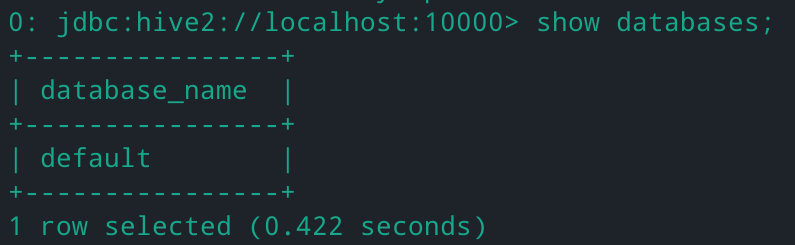
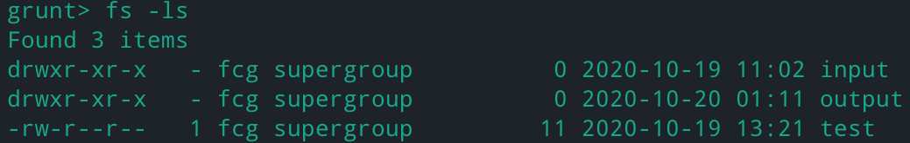

# HBase/Hive/Pig 安装指导

---

> - By 信息科学技术学院 郑力 冯存光
> - 文档如有错误或建议，烦请联系助教

---

**Tip**：配置过程中勤用虚拟机的“快照”功能

**环境**：请根据**Hadoop 指导文档**配置完成伪分布式版 Hadoop 并正常运行，再使用本文档。 本文档中的安装过程是在配置好伪分布式 Hadoop 的 ubuntu 虚拟机上进行。有兴趣的同学亦可自行尝试在全分布式 Hadoop 环境下进行安装。

**网络**：若你也完成了全分布式 Hadoop 的配置，此时 VMware 的网络选项已被修改，可能需要更改当前伪分布式虚拟机的网络配置。

---

保证你的 Hadoop 正常运行中：

```sh
start-dfs.sh
```

[TOC]

## **HBase**

1. 下载，解压，并修改权限

    ```sh
    cd ~/Downloads/
    wget https://mirrors.tuna.tsinghua.edu.cn/apache/hbase/stable/hbase-2.2.5-bin.tar.gz
    sudo mkdir /usr/local/hbase
    sudo tar xzvf hbase-2.2.5-bin.tar.gz -C /usr/local/hbase
    sudo chmod -R 755 /usr/local/hbase
    sudo chown -R alice:alice /usr/local/hbase
    ```

2. 修改系统配置文件

    ```sh
    gedit ~/.bashrc
    ```

    新增如下两行保存

    ```sh
    export HBASE_HOME=/usr/local/hbase/hbase-2.2.5
    export PATH=$PATH:$HBASE_HOME/bin
    ```

    执行 `source ~/.bashrc`生效。

3. 修改 HBase 配置文件

    ```sh
    gedit /usr/local/hbase/hbase-2.2.5/conf/hbase-env.sh
    ```

    找到如下两行，去掉#号并修改

    ```sh
    export JAVA_HOME=/usr/lib/jvm/java-8-openjdk-amd64
    export HBASE_MANAGES_ZK=true
    ```

    再将`/usr/local/hbase/hbase-2.2.5/conf/hbase-site.xml`修改为

    ```xml
    <configuration>
        <property>
            <name>hbase.rootdir</name>
            <value>hdfs://localhost:9000/hbase</value>
        </property>
        <property>
            <name>hbase.cluster.distributed</name>
            <value>true</value>
        </property>
        <property>
            <name>dfs.replication</name>
            <value>1</value>
        </property>
    </configuration>
    ```

4. 启动 HBase

    ```sh
    start-hbase.sh
    ```

    成功后可以用`jps`查看进程，会看到新增了 HMaster、HRegionServer、HQuorumPeer。

    启动 HBase shell：

    ```sh
    hbase shell
    ```

5. 增删改查命令
    在HBase shell中输入以下命令

    ```hbase
    # 创建表的格式：create '表名', '列族名1', '列族名2', '列族名3'
    create 'tempTable', 'f1', 'f2', 'f3'
    # 列出所有表的信息
    list
    # 向表tempTable中的第r1行、第“f1:c1”列, 添加数据值为“hello,dblab”
    put 'tempTable', 'r1', 'f1:c1', 'hello, dblab'
    # 从tempTable中,获取第r1行
    get 'tempTable', 'r1'
    # 从tempTable中,获取第r1行列族f1
    get 'tempTable', 'r1', 'f1'
    # 从tempTable中,获取第r1行,列族f1中c1列的值
    get 'tempTable', 'r1', {COLUMN=>'f1:c1'}
    ```

输入`exit` 或 ctrl c 退出

关闭 HBase 命令：

```sh
stop-hbase.sh
```

---

## **Hive**

1. 下载，解压并修改权限

   ```sh
   cd ~/Downloads
   wget https://mirrors.tuna.tsinghua.edu.cn/apache/hive/stable-2/apache-hive-2.3.7-bin.tar.gz
   sudo mkdir /usr/local/hive
   sudo tar xzvf apache-hive-2.3.7-bin.tar.gz -C /usr/local/hive
   sudo chmod -R 755 /usr/local/hive/apache-hive-2.3.7-bin
   sudo chown -R alice:alice /usr/local/hive/apache-hive-2.3.7-bin
   ```

2. 修改系统配置

   编辑 `~/.bashrc`新增如下几行

   ```sh
   export HIVE_HOME=/usr/local/hive/apache-hive-2.3.7-bin
   export PATH=$PATH:$HIVE_HOME/bin
   export CLASSPATH=$CLASSPATH:/usr/local/Hadoop/lib/*:.
   export CLASSPATH=$CLASSPATH:/usr/local/hive/lib/*:.
   ```

   执行 `source ~/.bashrc`生效。

   ```sh
   hadoop fs -mkdir       /tmp
   hadoop fs -mkdir -p   /user/hive/warehouse
   hadoop fs -chmod 777   /tmp
   hadoop fs -chmod 777   /user/hive/warehouse
   ```

   编辑 `/usr/local/hadoop/hadoop-2.7.7/etc/hadoop/core-site.xml` 加入

   ```xml
   <property>
     <name>hadoop.proxyuser.alice.groups</name>
     <value>*</value>
   </property>
   <property>
     <name>hadoop.proxyuser.alice.hosts</name>
     <value>*</value>
   </property>
   ```

   初始化，

   ```sh
   cd /usr/local/hive/apache-hive-2.3.7-bin/
   rm -r metastore_db/
   schematool -dbType derby -initSchema
   ```

   启动 hiveserver2，

   ```sh
   ./bin/hive --service hiveserver2 --hiveconf hive.server2.thrift.port=10000 --hiveconf hive.root.logger=INFO,console
   ```

   然后 Ctrl Shift T 新建一个窗口，执行

   ```sh
   ./bin/beeline -u jdbc:hive2://localhost:10000
   ```

   查看数据库

   `!exit`或 ctrl c 退出 beeline shell。

   切换到 hiveserver2 窗口，ctrl c 退出。

## **Pig**

1. 下载，解压并设置权限

   ```sh
   cd ~/Downloads/
   wget https://mirrors.tuna.tsinghua.edu.cn/apache/pig/pig-0.17.0/pig-0.17.0.tar.gz
   sudo mkdir /usr/local/pig
   sudo tar xzvf pig-0.17.0.tar.gz -C /usr/local/pig
   sudo chmod -R 755 /usr/local/pig/pig-0.17.0
   sudo chown -R alice:alice /usr/local/pig/pig-0.17.0
   ```

2. 系统环境配置

   编辑 `~/.bashrc`新增如下几行

   ```sh
   export PIG_HOME=/usr/local/pig/pig-0.17.0
   export PATH=$PATH:$PIG_HOME/bin
   export PIG_CLASSPATH=$HADOOP_HOME/etc/hadoop
   ```

   执行 `source ~/.bashrc`生效。

3. 启动 Pig

   ```sh
   cd /usr/local/pig/pig-0.17.0
   ./bin/pig -x mapreduce
   ```

   使用 fs 命令调用 HDFS 的命令

   `quit`退出

