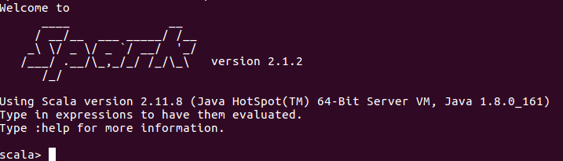

# Spark安装指导

> - By 信息科学技术学院 郑力 冯存光
> - 文档如有错误或建议，烦请联系助教

保证你的Hadoop正常运行中：

```sh
cd /usr/local/hadoop/hadoop-2.7.5
./sbin/start-dfs.sh
```

## Spark安装

1. 下载，解压及修改权限

    ```sh
    cd ~/Downloads/
    wget http://mirrors.tuna.tsinghua.edu.cn/apache/spark/spark-2.1.2/spark-2.1.2-bin-hadoop2.7.tgz
    sudo mkdir /usr/local/spark
    sudo tar zxf spark-2.1.2-bin-hadoop2.7.tgz -C /usr/local/spark
    sudo chmod -R 755 /usr/local/spark/spark-2.1.2-bin-hadoop2.7
    sudo chown -R hadoop:hadoop /usr/local/spark/spark-2.1.2-bin-hadoop2.7
    ```

2. spark配置

    ```sh
    cd /usr/local/spark/spark-2.1.2-bin-hadoop2.7/
    cp ./conf/spark-env.sh.template ./conf/spark-env.sh
    gedit ./conf/spark-env.sh
    ```

    在文件末尾加入如下一行(注意hadoop路径)

    ```sh
    export SPARK_DIST_CLASSPATH=$(/usr/local/hadoop/hadoop-2.7.5/bin/hadoop classpath)
    ```

3. 运行例子

    ```sh
    ./bin/run-example SparkPi 2>&1 | grep "Pi is roughly"
    ```

    可以得到π的近似值。

4. 交互模式

    ```sh
    ./bin/spark-shell
    ```

    即可利用Scala进行交互分析

    

5. RDD简单示例

    ```scala
    val textFile = sc.textFile("file:///usr/local/spark/spark-2.1.2-bin-hadoop2.7/README.md")

    textFile.count()  // RDD 中的 item 数量，对于文本文件，即总行数
    // res0: Long = 104
    textFile.first() // RDD 中的第一个 item，对于文本文件，就是第一行内容
    // res1: String = # Apache Spark
    textFile.filter(line => line.contains("Spark")).count()// 统计包含 Spark 的行数
    //res2: Long = 20
    textFile.map(line => line.split(" ").size).reduce((a, b) => if (a > b) a else b)  //找到单词最多的一行，并返回单词数
    //res3: Int = 22
    ```
