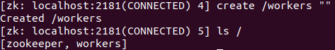
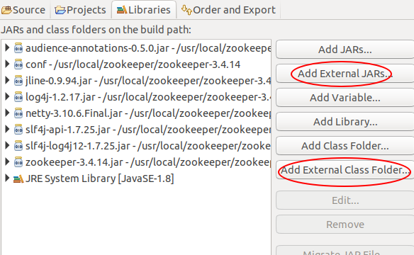

# ZooKeeper

[TOC]

## 安装运行

ZooKeeper 用 java 写成，以下示范在 Linux 上完成，但在其它操作系统上类似。

```sh
wget https://mirrors.tuna.tsinghua.edu.cn/apache/zookeeper/stable/zookeeper-3.4.14.tar.gz
sudo mkdir /usr/local/zookeeper
sudo chmod -R 777 !$
tar -xf zookeeper-3.4.14.tar.gz -D !$
cd /usr/local/zookeeper/zookeeper-3.4.14
mv conf/zoo_sample.cfg conf/zoo.cfg   # 配置文件
```

bin 目录存放着脚本命令。启动 ZooKeeper 服务（Windows 执行相应扩展名为.cmd 的脚本）

```sh
./bin/zkServer.sh start-foreground
```

成功启动的话会打印一些系统环境配置信息，显示"binding to port 0.0.0.0/0.0.0.0:2181"，这是 conf/zoo.cfg 里配置的。ZooKeeper 组成集群运行，仲裁算法已经写好，配置也很简单，这里只使用单个服务器。

自带客户端运行

```sh
./bin/zkCli.sh
```

## 客户端使用

ZooKeeper 并没有提供锁机制的原语列表，而是提供了类似文件系统的机制。这些类似目录和文件的数据节点称为 znode 。每个 znode 都有存储的内容信息，每个节点也都可以有子节点。

znode 有 4 种类型：持久的，临时的，持久有序的，临时有序的。ZooKeeper 提供关于这些 znode 上的订阅发布服务。

使用 `ls /` 查看根节点下所有子节点的列表，显示只有 zookeeper 一个节点。

使用 `create /workers ""` 创建一个存放当前所有活跃的 worker 的 znode，内容为""，不可省略。

创建一个临时且有序的 worker 节点，临时(ephemeral)指的是超时或关闭后会被删除。有序(sequientail)会在节点名后分配唯一一个单调递增的整数。 `create -e -s /workers/worker- "hostportofthisworker"`

获取节点信息 `get /workers/worker-0000000001` 。保持第一个客户端运行，启动第二个客户端，来监视 workers 节点下子节点的变化，`ls /workers True` ，True 表示添加监点。`stat /workers/worker-0000000001 True` 监视该节点内容的变化。回到第一个客户端设置节点信息 `set /workers/worker-0000000001 "newhostport"`，发现第二个客户端收到了该节点信息变化的通知。

```text
WATCHER::

WatchedEvent state:SyncConnected type:NodeDataChanged path:/workers/worker-0000000001
```

按 Ctrl C 关闭第一个客户端，第一个客户端创建的临时节点会在超时后销毁。过一段时间会发现第二个客户端收到了子节点变动的信息：

```text
WATCHER::

WatchedEvent state:SyncConnected type:NodeDataChanged path:/workers/worker-0000000001
```

## 编程实现排它锁

### java

在 eclipse 中导入 jar 包，并把 conf 文件夹作为 class folder 加入。

```java
import java.io.IOException;
import java.util.List;
import java.util.concurrent.CountDownLatch;

import org.apache.zookeeper.CreateMode;
import org.apache.zookeeper.KeeperException;
import org.apache.zookeeper.WatchedEvent;
import org.apache.zookeeper.Watcher;
import org.apache.zookeeper.ZooKeeper;
import org.apache.zookeeper.data.Stat;
import org.apache.zookeeper.ZooDefs.Ids;

public class XLock {
    private final ZooKeeper zk;
    private final String root = "/xlocks", prefix = "lock-";
    private final String lockPrefix = root + "/" + prefix;
    final static String hostport = "127.0.0.1:2181";
    String lock = null;

    public XLock() throws IOException {
        zk = new ZooKeeper(hostport, 15000, (event) -> {});
    }

    public void lock() throws KeeperException, InterruptedException {
        String lockNode = zk.create(lockPrefix, " ".getBytes(), Ids.OPEN_ACL_UNSAFE, CreateMode.EPHEMERAL_SEQUENTIAL);
        while (true) {// 不断循环直到自己是最小的节点
            List<String> children = zk.getChildren(root, false);
            String closest = closest(children, lockNode.substring(lockNode.lastIndexOf("/") + 1));
            System.out.println(children);
            System.out.println(lockNode);
            System.out.println(closest);
            if (closest.equals(lockNode)) {
                lock = lockNode;
                break;
            }
            final CountDownLatch signal = new CountDownLatch(1);
            Stat exists = zk.exists(closest, new Watcher() {
                @Override
                public void process(WatchedEvent event) {
                    // 监视的节点被删除
                    if (event.getType() == Event.EventType.NodeDeleted) {
                        signal.countDown();
                    }

                }
            });
            // 返回null说明节点不存在，反之存在阻塞等待。
            if (exists != null) {
                signal.await();// 阻塞直到signal.countDown执行。
            }
        }
    }

    private String closest(List<String> children, String lockNode) {
        // 寻找比自己小的节点，如果没有返回自己。
        int nodeVal = valueOf(lockNode);
        int closestVal = -1;
        String closestNode = lockNode;
        for (String child : children) {
            int childVal = valueOf(child);
            if (childVal < nodeVal && childVal > closestVal) {
                closestVal = childVal;
                closestNode = child;
            }
        }
        return root + "/" + closestNode;
    }

    private int valueOf(String node) {
        // 返回该节点的序号(后缀)
        int i = node.lastIndexOf(prefix);
        String substring = node.substring(i + prefix.length());
        return Integer.valueOf(substring);
    }

    public void unlock() throws InterruptedException, KeeperException {
        zk.delete(lock, -1);
    }

    public static void main(String[] args) throws IOException {
        //测试
        for (int i = 0; i < 10; i++) {
            // 并发子线程
            new Actor(i).start();
        }
        System.in.read();

    }
}

class Actor extends Thread {
    int id;
    XLock lock;

    public Actor(int id) throws IOException {
        this.id = id;
        lock = new XLock();
    }

    public void run() {
        try {
            System.out.println("等待锁 " + id);
            lock.lock();
            System.out.println("获取到锁 " + id);
            Thread.sleep(1000);
            lock.unlock();
            System.out.println("释放锁 " + id);
        } catch (InterruptedException | KeeperException e) {
            e.printStackTrace();
        }
    }
}

```

### 命令行编译运行

zkEnve.sh 脚本会帮助我们设置好环境变量

```sh
ZOOBINDIR=/usr/local/zookeeper/zookeeper-3.4.14/bin
. "$ZOOBINDIR"/zkEnve.sh这样会设置好CLASSPATH变量
```

编译， 每个类会生成一个 类名.class 文件，匿名类带有\$符号。

```sh
javac -cp $CLASSPATH XLock.java
```

运行，指定含有 main 方法的类。

```sh
java -cp $CLASSPATH XLock
```

