# Hadoop指导文档

[TOC]


> - By 信息科学技术学院 郑力 冯存光
> -  文档如有错误或建议，烦请联系助教

## 安装配置虚拟机

安装好虚拟机和 ubuntu 18.04 LTS 并启动。

## 安装 jdk hadoop 等软件

将软件源替换为 TUNA 的软件源镜像 ，加快软件下载速度

Ubuntu 的软件源配置文件是 /etc/apt/sources.list

```shell
sudo gedit /etc/apt/sources.list
```

然后将该文件内容替换为下面内容，ctrl s 保存。

```
# 默认注释了源码镜像以提高 apt update 速度，如有需要可自行取消注释
deb https://mirrors.tuna.tsinghua.edu.cn/ubuntu/ bionic main restricted universe multiverse
# deb-src https://mirrors.tuna.tsinghua.edu.cn/ubuntu/ bionic main restricted universe multiverse
deb https://mirrors.tuna.tsinghua.edu.cn/ubuntu/ bionic-updates main restricted universe multiverse
# deb-src https://mirrors.tuna.tsinghua.edu.cn/ubuntu/ bionic-updates main restricted universe multiverse
deb https://mirrors.tuna.tsinghua.edu.cn/ubuntu/ bionic-backports main restricted universe multiverse
# deb-src https://mirrors.tuna.tsinghua.edu.cn/ubuntu/ bionic-backports main restricted universe multiverse
deb https://mirrors.tuna.tsinghua.edu.cn/ubuntu/ bionic-security main restricted universe multiverse
# deb-src https://mirrors.tuna.tsinghua.edu.cn/ubuntu/ bionic-security main restricted universe multiverse

# 预发布软件源，不建议启用
# deb https://mirrors.tuna.tsinghua.edu.cn/ubuntu/ bionic-proposed main restricted universe multiverse
# deb-src https://mirrors.tuna.tsinghua.edu.cn/ubuntu/ bionic-proposed main restricted universe multiverse
```

安装 jdk8

```shell
sudo apt update #更新软件源的metadata
sudo apt install openjdk-8-jdk-headless
sudo apt install net-tools openssh-server
```

配置环境变量

```sh
gedit ~/.bashrc
```

在文件末另起一行添加如下内容，并保存

```shell
export JAVA_HOME=/usr/lib/jvm/java-8-openjdk-amd64/
```

运行命令 source ~/.bashrc 使之生效。

然后我们下载hadoop，并解压到 /usr/local/hadoop/ ，最后修改权限：

```sh
cd ~/Downloads
wget "https://mirrors.tuna.tsinghua.edu.cn/apache/hadoop/common/hadoop-2.7.7/hadoop-2.7.7.tar.gz"

sudo mkdir /usr/local/hadoop
sudo tar xzf hadoop-2.7.7.tar.gz -C /usr/local/hadoop

sudo chmod -R 755 /usr/local/hadoop/hadoop-2.7.7
sudo chown -R alice:alice /usr/local/hadoop/hadoop-2.7.7
```

运行一下hadoop看版本信息

```sh
/usr/local/hadoop/hadoop-2.7.7/bin/hadoop version
```

为了方便以后每次运行hadoop都不用写这么长的路径，配置一下环境变量，在~/.bashrc文件末加上如下内容并保存。

```sh
export HADOOP_HOME=/usr/local/hadoop/hadoop-2.7.7
export PATH=$PATH:$HADOOP_HOME/sbin
export PATH=$PATH:$HADOOP_HOME/bin
```

然后运行命令  source ~/.bashrc 使之生效。当我们再次运行 /usr/local/hadoop/hadoop-2.7.7/sbin 和  /usr/local/hadoop/hadoop-2.7.7/sbin 目录下的程序的时候，不用再长长的输入绝对路径： 

## Hadoop单机版/伪分布式版

### 单机版运行

Hadoop默认即为单机版。

```sh
    cd /usr/local/hadoop/hadoop-2.7.7
    mkdir ./input
    cp ./etc/hadoop/*.xml ./input   # 将配置文件作为输入文件
    hadoop jar share/hadoop/mapreduce/hadoop-mapreduce-examples-2.7.7.jar grep input output 'dfs[a-z.]+'
    cat ./output/*          # 查看运行结果
```

结果表明符合正则表达式'dfs[a-z.]+'的单词只出现了一次： 

Hadoop不会自动覆盖结果文件，如想再运行上述例子需先删除结果

```sh
rm -r ./output
```

### 伪分布式版配置和启动

1. ssh 无密登陆设置

尝试使用 ssh 登陆本机

```sh
ssh localhost
```

第一次登陆会有SSH登陆提示，输入yes，并输入用户密码，即可SSH登陆至本机。然后配置SSH无密码登陆：

```sh
exit                   # 退出刚才的 ssh localhost
cd ~/.ssh/             # 若没有该目录，请先执行一次ssh localhost
ssh-keygen -t rsa      # 生成密钥对，会有提示，都按回车就可以
cat ./id_rsa.pub >> ./authorized_keys  # 加入授权
```

此时再 ssh localhost 即可无密登陆，注意记得exit回原终端。

1. 修改hadoop的配置文档

修改 /usr/local/hadoop/hadoop-2.7.7/etc/hadoop/core-site.xml 配置文件 未修改之前是： 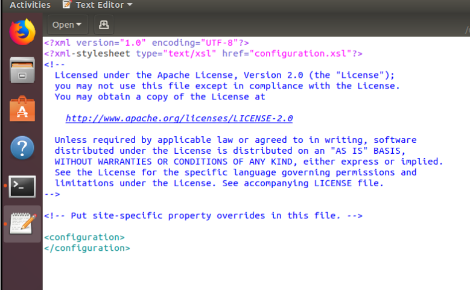

配置改成

```xml
<configuration>
    <property>
             <name>hadoop.tmp.dir</name>
             <value>file:/usr/local/hadoop/hadoop-2.7.7/tmp</value>
             <description>Abase for other temporary directories.</description>
        </property>
        <property>
             <name>fs.defaultFS</name>
             <value>hdfs://localhost:9000</value>
        </property>
</configuration>
```

然后修改 /usr/local/hadoop/hadoop-2.7.7/etc/hadoop/hdfs-site.xml

```xml
<configuration>
        <property>
             <name>dfs.replication</name>
             <value>1</value>
        </property>
        <property>
             <name>dfs.namenode.name.dir</name>
             <value>file:/usr/local/hadoop/hadoop-2.7.7/tmp/dfs/name</value>
        </property>
        <property>
             <name>dfs.datanode.data.dir</name>
             <value>file:/usr/local/hadoop/hadoop-2.7.7/tmp/dfs/data</value>
        </property>
</configuration>
```

先别急，修改 `/usr/local/hadoop/hadoop-2.7.7/etc/hadoop/hadoop-env.sh` ，将 `export JAVA_HOME=${JAVA_HOME}` 改成 `export JAVA_HOME=/usr/lib/jvm/java-8-openjdk-amd64`

3.执行 NameNode 的格式化：

```
hdfs namenode -format
```

出现“Exitting with status 0” 的提示说明成功。

4.接着开启 NameNode 和 DataNode 守护进程：

```
start-dfs.sh
```

5.启动完成后，可以通过命令jps来判断是否成功启动，若成功启动则会列出如下进程: 

此时打开firefox访问 <http://localhost:50070> 可以查看 NameNode 和 Datanode 信息，还可以在线查看 HDFS 中的文件。

### 伪分布式版实例运行

1.创建目录，并将本地配置文件作为输入复制到分布式系统。

```sh
hdfs dfs -mkdir -p /user/alice
hdfs dfs -mkdir input
cd /usr/local/hadoop/hadoop-2.7.7
hdfs dfs -put ./etc/hadoop/*.xml input
```

上面最后一条命令执行后，可能会报一个WARN，但是无妨，通过如下命令查看文件是否被传到input文件夹下了

```
hdfs dfs -ls input
```


2.执行实例,并查看结果

```
hadoop jar ./share/hadoop/mapreduce/hadoop-mapreduce-examples-*.jar grep input output 'dfs[a-z.]+'
hdfs dfs -cat output/*
```

结果： 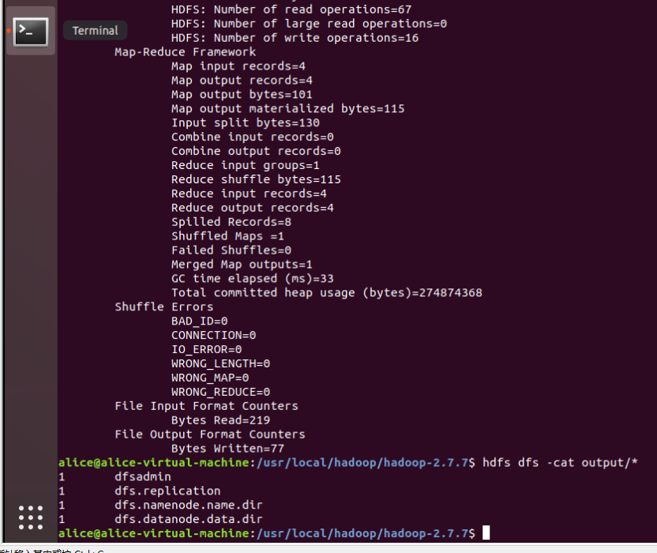

3.将结果取回本地

```sh
rm -r ./output    # 先删除本地的 output 文件夹（如果存在）
hdfs dfs -get output ./output     # 将结果拷贝到本机
cat ./output/*
```

4.为不影响下次运行，及时删除输出文件

```
hdfs dfs -rm -r output
```

5.关闭hadoop

```
stop-dfs.sh
```

下次开启时无需格式化，仅需命令 `start-dfs.sh` 即可

## Hadoop全分布式版

请先完成上述单机版/伪分布式版后再进行本版本操作

### 基础网络配置

1.  虚拟机复制
    将之前配置好的带有伪分布式版Hadoop的Ubuntu系统链接克隆三份，分别为Master、Slave1、Slave2(至少需要一个Master和一个Slave，原虚拟机也需保留，之后其他软件安装时会有用到) 

    
    
2. 管理-->全局设定-->网络-->NatNetwork(若没有请添加新的NAT网络)-->编辑NAT网络。
   

取消勾选"支持DHCP"，填写网络CIDR为 `192.168.8.0/24` ，确定。

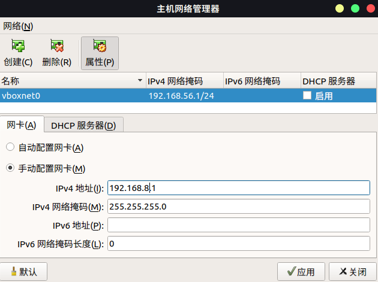 

3. 确保每个虚拟机都是NAT模式以及mac地址互不相同。

   选中虚拟机，设置-->网络-->网卡1-->连接方式设为NAT网络，界面名称设为刚才创建的NAT网络名称。MAC地址可以随机生成防止冲突(克隆时已经随机生成了)。

   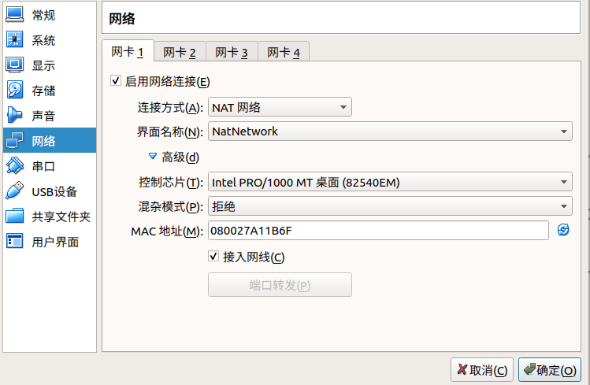

4. Ubuntu网络配置。

   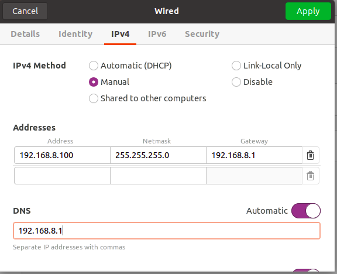

本教程中，三节点的Address分别设置为 192.168.8.100/101/102

5. hosts配置 在Master机中，修改主机名,将原名直接替换为“Master”即可。

```sh
sudo gedit /etc/hostname
```

之后修改/etc/hosts的前几行，如下配置。注意127.0.0.1仅可对应localhost，不可保留有其他对应行。

```
127.0.0.1   localhost
192.168.8.100   Master
192.168.8.101   Slave1
192.168.8.102   Slave2
```

在Slave1、Slave2机上作类似操作，操作后均需重启生效。 在3个虚拟机上分别尝试互相Ping，如果都能ping通则没问题。

```sh
ping -c 3 Master
ping -c 3 Slave1
ping -c 3 Slave2
```

### 无密码登录节点

由于Master和Slave都是从伪分布式配置后的虚拟机克隆的，含有一样的密钥对，所以正常情况下能够登陆：

```sh
ssh Master
ssh Slave1
ssh Slave2
```

输入yes回车即可登陆成功，exit退回原来终端后再次ssh即可直接无密登陆。
 如果不能成功，请按照文末 [无密码登录](#无密码登录配置) 配置进行配置。

### 分布式环境配置

0. 配置/usr/local/hadoop/hadoop-2.7.7/etc/hadoop下的五个配置文件

```sh
cd /usr/local/hadoop/hadoop-2.7.7/etc/hadoop
```

1. slaves文件,将内容替换为如下内容

```
Slave1
Slave2
```

2. core-site.xml文件。将内容修改为如下内容(上面步骤已经改过此文件，此处实际只需将localhost改为Master)

```xml
<configuration>
    <property>
             <name>hadoop.tmp.dir</name>
             <value>file:/usr/local/hadoop/hadoop-2.7.7/tmp</value>
             <description>Abase for other temporary directories.</description>
        </property>
        <property>
             <name>fs.defaultFS</name>
             <value>hdfs://Master:9000</value>
        </property>
</configuration>
```

3. hdfs-site.xml文件

```xml
<configuration>
        <property>
                <name>dfs.namenode.secondary.http-address</name>
                <value>Master:50090</value>
        </property>
        <property>
             <name>dfs.replication</name>
             <value>2</value>
        </property>
        <property>
             <name>dfs.namenode.name.dir</name>
             <value>file:/usr/local/hadoop/hadoop-2.7.7/tmp/dfs/name</value>
        </property>
        <property>
             <name>dfs.datanode.data.dir</name>
             <value>file:/usr/local/hadoop/hadoop-2.7.7/tmp/dfs/data</value>
        </property>
</configuration>
```

4. mapred-site.xml文件。
    首先执行 `cp mapred-site.xml.template mapred-site.xml` 之后修改内容

```xml
<configuration>
        <property>
                <name>mapreduce.framework.name</name>
                <value>yarn</value>
        </property>
        <property>
                <name>mapreduce.jobhistory.address</name>
                <value>Master:10020</value>
        </property>
        <property>
                <name>mapreduce.jobhistory.webapp.address</name>
                <value>Master:19888</value>
        </property>
</configuration>
```

5. yarn-site.xml文件

```xml
<configuration>
        <property>
                <name>yarn.resourcemanager.hostname</name>
                <value>Master</value>
        </property>
        <property>
                <name>yarn.nodemanager.aux-services</name>
                <value>mapreduce_shuffle</value>
        </property>
</configuration>
```

最后我们需要把 Hadoop  从Master 复制到 Slave 节点， 但是由于我们之更改了一些配置文件，所以只需要复制Master的配置文件到Slave节点覆盖就好了。

```sh
#先清理一些临时文件
cd /usr/local/hadoop/hadoop-2.7.7;rm -r ./tmp ./logs/*
ssh Slave1 "cd /usr/local/hadoop/hadoop-2.7.7;rm -r ./tmp ./logs/*"
ssh Slave1 "cd /usr/local/hadoop/hadoop-2.7.7;rm -r ./tmp ./logs/*"
#复制Master的配置文件到Slave节点
scp /usr/local/hadoop/hadoop-2.7.7/etc/hadoop/* Slave1:/usr/local/hadoop/hadoop-2.7.7/etc/hadoop/
scp /usr/local/hadoop/hadoop-2.7.7/etc/hadoop/* Slave2:/usr/local/hadoop/hadoop-2.7.7/etc/hadoop/
```

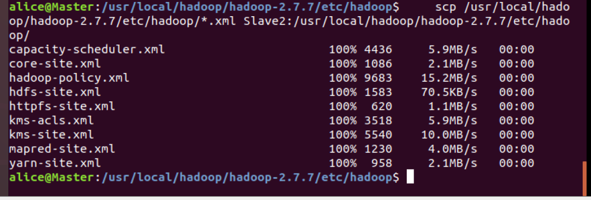

### 分布式版 Hadoop 启动

1. 格式化，仅第一次启动前需要执行(Master上执行)

```
hdfs namenode -format
```

2. 启动(Master上执行)

```
start-dfs.sh
start-yarn.sh
mr-jobhistory-daemon.sh start historyserver
```

通过jps命令可查看进程，在Master上进程如下(五个进程必须全部启动，如有缺失即为启动有错。端口号不一样为正常现象)


在Slave节点上进程如下 

另外，在Master上通过命令   `hdfs dfsadmin -report` 查看节点是否正常启动，若启动成功可在返回的报告中看到：Live datanodes (2) 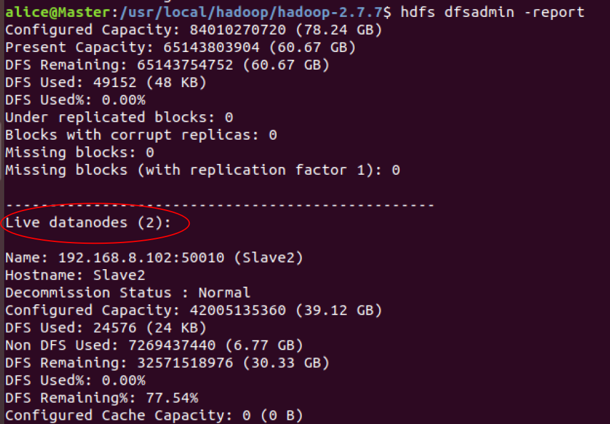

在firefox中查看网页 http://localhost:50070/dfshealth.html#tab-datanode 也可确定 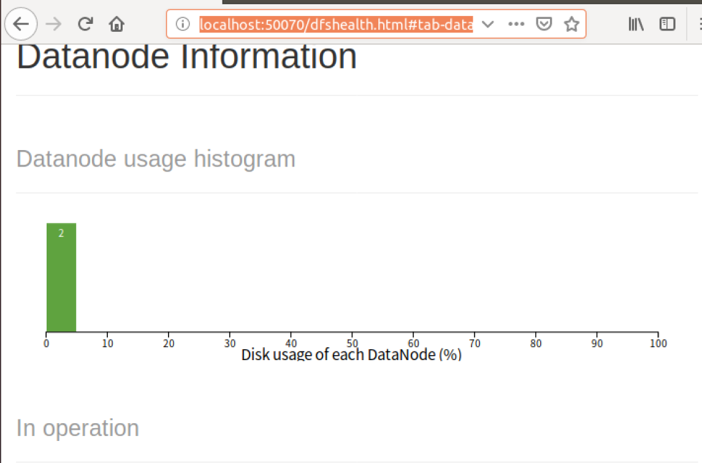

### 分布式版实例运行

0. 均在Master上执行操作 1.创建hdfs上的用户目录

```
hdfs dfs -mkdir -p /user/alice
```

2. 将本地文件复制入input

```
hdfs dfs -mkdir input
hdfs dfs -put /usr/local/hadoop/hadoop-2.7.7/etc/hadoop/*.xml input
hdfs dfs -ls input
```

在网页端可查看节点上的占用情况发生了变化，说明上传成功 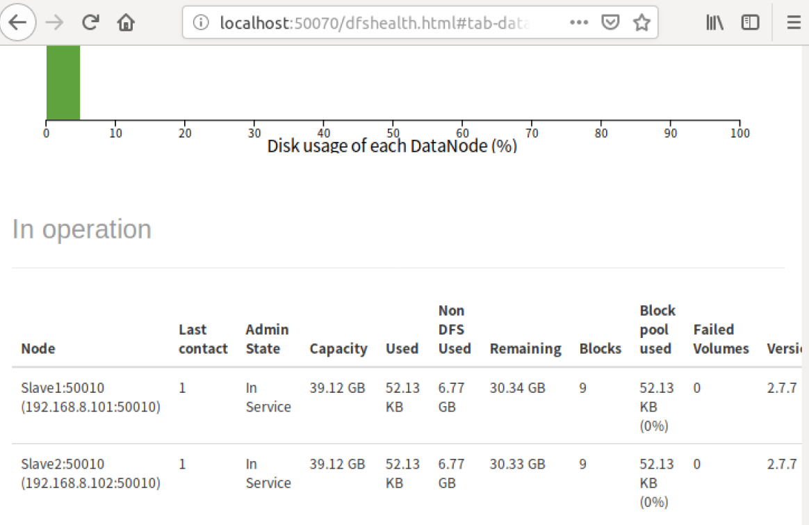

3. 执行实例

```sh
hadoop jar /usr/local/hadoop/hadoop-2.7.7/share/hadoop/mapreduce/hadoop-mapreduce-examples-*.jar grep input output 'dfs[a-z.]+'
```

运行时的输出信息与伪分布式类似，会显示 Job 的进度。 可能会有点慢，若迟迟没有进度(如5分钟)，不妨重启Hadoop再试试。若仍不行，则很有可能是内存不足引起，建议增大虚拟机的内存

4. 获取结果

```sh
hdfs dfs -cat output/*
```

结果如下 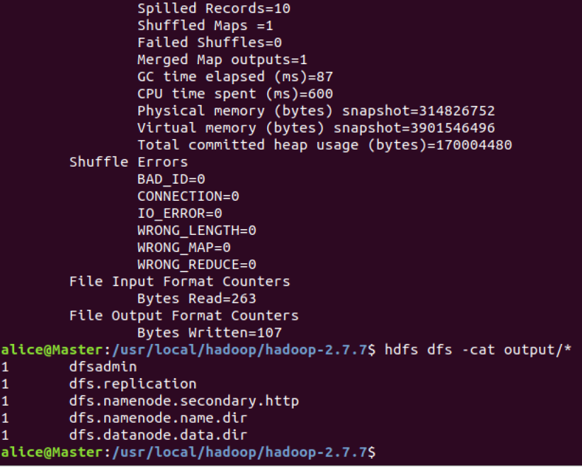

5. 关闭Hadoop

```
stop-yarn.sh
stop-dfs.sh
mr-jobhistory-daemon.sh stop historyserver
```


## 编写 Hadoop 应用

### Eclipse中编写 Hadoop 应用

使用eclipse编写Java可以方便代码补全和提示。安装eclipse (在Master节点)

```sh
cd Downloads
wget "https://mirrors.tuna.tsinghua.edu.cn/eclipse/technology/epp/downloads/release/luna/SR2/eclipse-java-luna-SR2-linux-gtk-x86_64.tar.gz"
```

解压后，双击eclipse文件夹下的eclipse运行

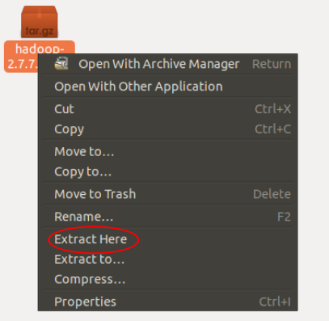 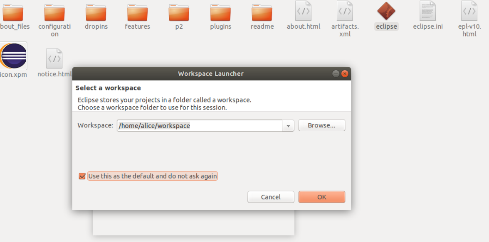 

我们来导入hadoop的jar包，菜单栏Window --> Preferences --> Java --> Build Path --> User Libraries --> New 输入 hadoop_common 。  

然后选中hadoop_common 添加外部jar，浏览到/usr/local/hadoop/hadoop2.7.7/share/hadoop/common，添加这个目录下的所有.jar文件(按住ctrl多选)，然后添加/usr/local/hadoop/hadoop2.7.7/share/hadoop/common/lib下的所有jar包。

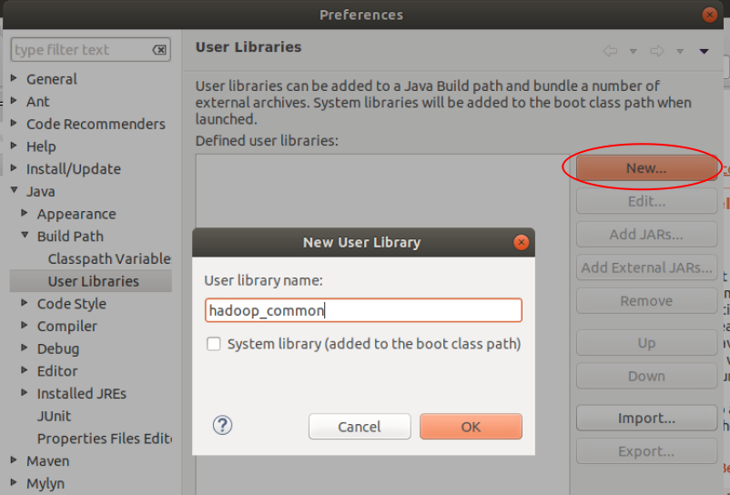 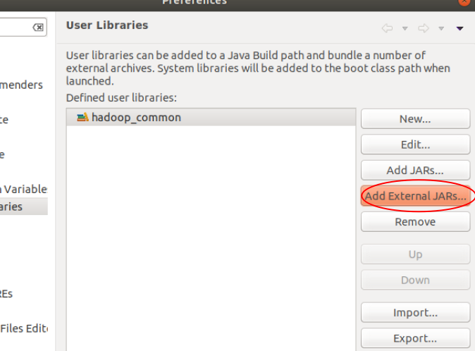 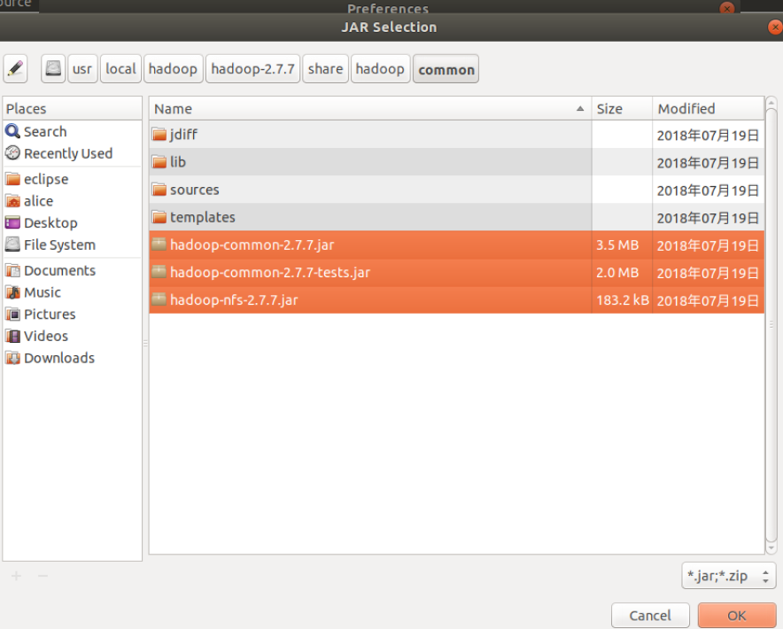 

按此过程依次添加/usr/local/hadoop/hadoop2.7.7/share/hadoop下的如下jar包：

```
新建 hadoop_hdfs 的用户库，然后添加 share\hadoop\hdfs 和 share\hadoop\hdfs\lib 下的jar包
新建 hadoop_mapreduce 的用户库，然后添加 share\hadoop\mapreduce 和 share\hadoop\mapreduce\lib 下的jar包
```

 添加完成后：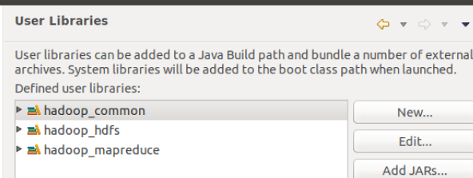

然后我们新建java工程， 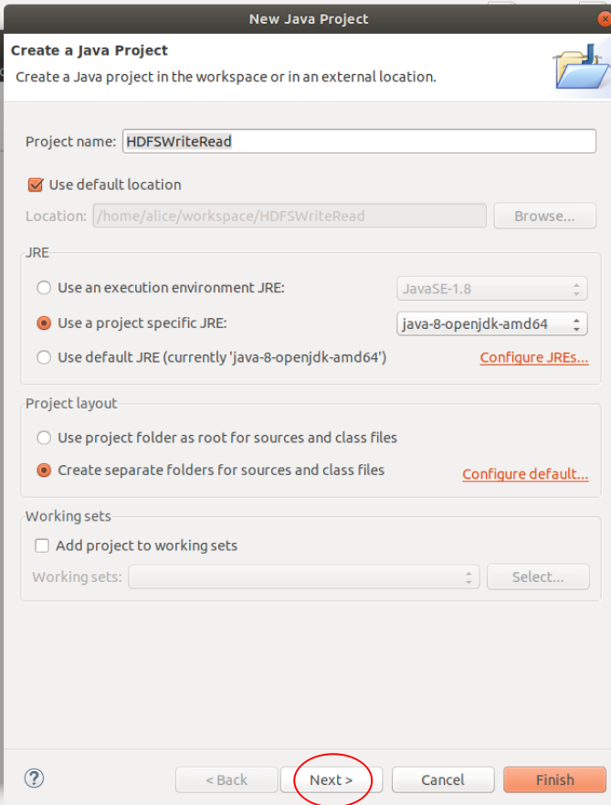 

新建过程中加入用户库，不过对于这个简单的例子包含 hadoop_common 和 hadoop_hdfs 就可以了：

 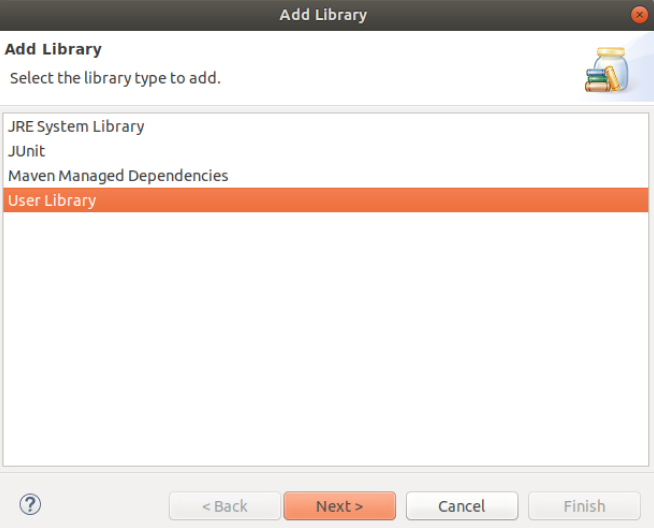 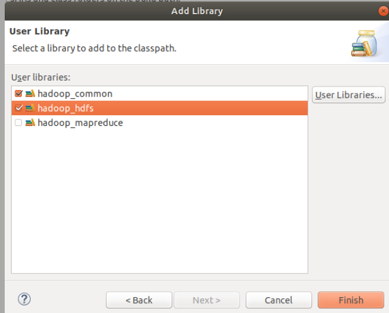

建好工程后在src上右键新建类：

    

确保你的三个虚拟机以及hdfs都处在开启状态。

编写hdfs读写程序样例

```java
import org.apache.hadoop.conf.Configuration;
import org.apache.hadoop.fs.FileSystem;
import org.apache.hadoop.fs.Path;
import org.apache.hadoop.fs.FSDataOutputStream;
import org.apache.hadoop.fs.FSDataInputStream;
import java.io.BufferedReader;
import java.io.IOException;
import java.io.InputStreamReader;

public class HDFSWriteRead {
	public static void main(String[] args){
		try{
			String fileName = "test";
			Configuration conf = new Configuration();
			conf.set("fs.defaultFS", "hdfs://Master:9000");
			conf.set("fs.hdfs.impl", "org.apache.hadoop.hdfs.DistributedFileSystem");
			FileSystem fs = FileSystem.get(conf);
			Path file = new Path(fileName);
			if(fs.exists(file)){
				System.out.println("File exists");
			}else{
				System.out.println("File does not exist");
				createFile(fs,file);
			}
			readFile(fs,file);
			fs.close();
		}catch (Exception e){
			e.printStackTrace();
		}
	}
	public static void createFile(FileSystem fs, Path file) throws IOException{
		byte[] buff = "Hello World".getBytes();
		FSDataOutputStream os =fs.create(file);
		os.write(buff,0,buff.length);
		System.out.println("Create:"+file.getName());
		os.close();
	}
	public static void readFile(FileSystem fs, Path file) throws IOException{
			FSDataInputStream in = fs.open(file);
			BufferedReader d = new BufferedReader(new InputStreamReader(in));
			String content = d.readLine();
			System.out.println(content);
			d.close();
			in.close();
	}
}
```

该程序的功能是判断名字为test的文件是否存在于hdfs中，如果存在则读取内容，否则先创建再读取。   

运行结果如下

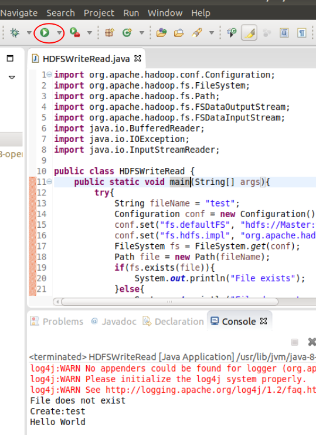

现在我们尝试将程序打包运行

```sh
mkdir /usr/local/hadoop-2.7.7/myapp
```

File --> Export --> Runnable JAR File --> Next 

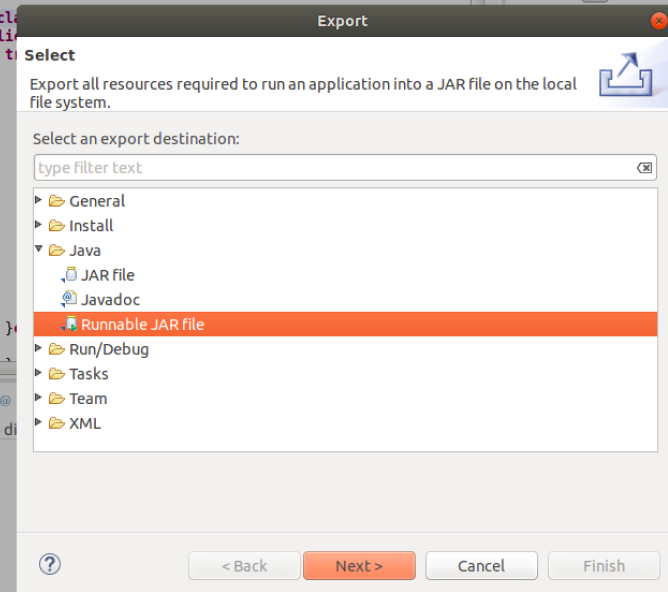 

进入目录运行hadoop执行该jar包：

### 命令行下编译运行hadoop应用

如果你使用的是Server版本的Ubuntu，需要在命令行下进行代码编辑和编译。否则不需要。

在~/.bashrc末尾添加

    export HADOOP_CLASSPATH=$(find $HADOOP_HOME -name '*.jar' | xargs echo | tr ' ' ':')

运行    
    source ~/.bashrc


然后编译打包运行：

    mkdir build
    javac -classpath ${HADOOP_CLASSPATH} -d build/ HDFSWriteRead.java
    jar -cvf HDFSWriteRead.jar -C build ./
    hadoop jar HDFSWriteRead.jar HDFSWriteRead

<u>[**恭喜，完成了！**](#Hadoop指导文档)</u>


## 附录

### 无密码登录配置

原理：首先由用户生成一对密钥，然后将公钥保存在SSH服务器用户的目录下.ssh子目录中的authorized_key文件里(/root/.ssh/authorized_key).私钥保存在本地计算机.当用户登陆时,服务器检查authorized_key文件的公钥是否与用户的私钥对应,如果相符则允许登入,否则拒绝.由于私钥只有保存在用户的本地计算机中,因此入侵者就算得到用户口令,也不能登陆到服务器.

在Master机上操作：

```sh
cd ~/.ssh           # 如果没有该目录，先执行一次ssh localhost
rm ./id_rsa*        # 删除之前生成的公匙（如果有）
ssh-keygen -t rsa   # 生成一对rsa密钥
```

使本机无密SSH本机，键入如下命令

```shell
cat ./id_rsa.pub >> ./authorized_keys
```

完成后尝试ssh Master验证(可能需要输入yes，之后exit退回原终端) 之后将公钥传输至Slave(需要输入节点密码)

```sh
scp ~/.ssh/id_rsa.pub Slave1:~/
scp ~/.ssh/id_rsa.pub Slave2:~/
```

在Slave1、Slave2上操作：

```sh
cat ~/id_rsa.pub >> ~/.ssh/authorized_keys
rm ~/id_rsa.pub    # 用完就可以删掉了
```

在Master上操作： 尝试是否能够无密登陆子节点

```sh
ssh Slave1 #注意exit回原终端
ssh Slave2 #注意exit回原终端
```

成功后就可以继续[配置分布式环境](#分布式环境配置)了

